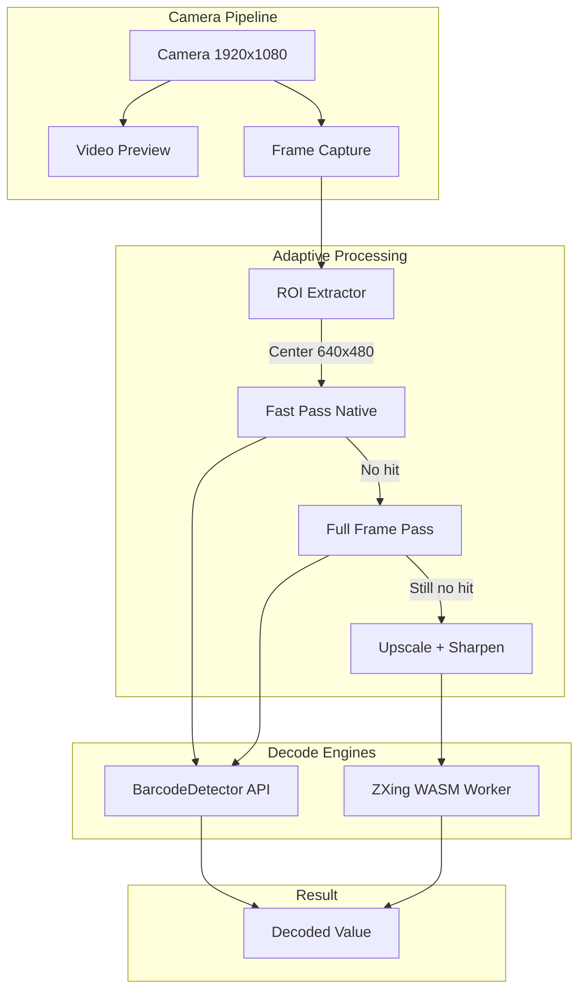

# Scandit-Level Scanner Performance Upgrade

## Current State Analysis

The scanner currently uses:
- Native `BarcodeDetector` API (Chrome/Android) with ZBar WASM fallback
- Fixed 70ms scan loop (~14 fps max)
- 1280x720 camera resolution
- 2x digital zoom max
- Full-frame processing (no ROI optimization)

**Why it feels slow:**
1. Fixed 70ms delay regardless of decode speed
2. Resolution too low for tiny codes at distance
3. No region-of-interest (ROI) prioritization
4. ZBar WASM fallback sends full frames without downscaling

---

## Architecture Overview



---

## Phase 1: Camera Resolution and Zoom (Quick Wins)

**File:** [src/components/shared/LiveQrScanner.tsx](src/components/shared/LiveQrScanner.tsx)

### 1.1 Increase camera resolution to 1080p

```typescript
// Current
video: {
  width: { ideal: 1280 },
  height: { ideal: 720 },
}

// Upgrade to
video: {
  width: { ideal: 1920 },
  height: { ideal: 1080 },
  frameRate: { ideal: 30, min: 24 },
}
```

### 1.2 Increase digital zoom for tiny codes

```typescript
// Current: min(2, capabilities.zoom.max)
// Upgrade: min(3, capabilities.zoom.max) with UI control

// Add pinch-to-zoom or auto-zoom when no decode after N frames
```

### 1.3 Enable torch by default in dim conditions

Add ambient light detection via `AmbientLightSensor` API (if available) or manual toggle prominence.

---

## Phase 2: Adaptive Scan Rate (Major Performance Gain)

**File:** [src/components/shared/LiveQrScanner.tsx](src/components/shared/LiveQrScanner.tsx)

### 2.1 Replace fixed 70ms with requestAnimationFrame + throttle

```typescript
// Current: setTimeout(..., 70) fixed
// Upgrade: rAF-driven with adaptive throttle

const MIN_SCAN_INTERVAL_MS = 33;  // 30fps max when idle
const FAST_SCAN_INTERVAL_MS = 16; // 60fps burst after near-hit

let lastScanTime = 0;
let scanInterval = MIN_SCAN_INTERVAL_MS;

function scanLoop(timestamp: number) {
  if (timestamp - lastScanTime >= scanInterval) {
    lastScanTime = timestamp;
    await performScan();
  }
  requestAnimationFrame(scanLoop);
}
```

### 2.2 Burst mode on "almost decoded" signal

When BarcodeDetector returns partial/low-confidence results, temporarily increase scan rate.

---

## Phase 3: ROI-Based Scanning for Tiny Codes (Critical)

**New file:** `src/lib/scanner/roiProcessor.ts`

### 3.1 Center-crop first strategy

```typescript
// Instead of always scanning full 1920x1080:
// 1. First pass: center 640x480 crop (fast, high-res for tiny codes)
// 2. If no hit: expand to 960x720
// 3. If still no hit: full frame

function extractROI(
  video: HTMLVideoElement,
  canvas: HTMLCanvasElement,
  level: 'tight' | 'medium' | 'full'
): ImageBitmap {
  const { videoWidth: vw, videoHeight: vh } = video;
  const crops = {
    tight:  { w: vw * 0.33, h: vh * 0.44 }, // Center third
    medium: { w: vw * 0.5,  h: vh * 0.66 },
    full:   { w: vw,        h: vh },
  };
  // ... extract and return
}
```

### 3.2 Use ImageBitmap for zero-copy frame capture

```typescript
// Current: canvas.getContext('2d').drawImage(video, ...)
// Upgrade: createImageBitmap for GPU-accelerated extraction

const bitmap = await createImageBitmap(
  video,
  sx, sy, sw, sh,  // ROI coordinates
  { resizeWidth: targetW, resizeHeight: targetH }
);
```

---

## Phase 4: Upgrade WASM Fallback Engine

**Files:**
- [src/workers/qrScanner.worker.ts](src/workers/qrScanner.worker.ts)
- New: `src/workers/zxingScanner.worker.ts`

### 4.1 Replace or supplement ZBar with ZXing-C++ WASM

ZXing-C++ compiled to WASM (`@aspect-build/aspect-bundler` or prebuilt) is faster for:
- Tiny/damaged QR codes
- Perspective-distorted codes
- Low-contrast 1D barcodes

```bash
npm install @aspect-build/aspect-bundler zxing-cpp-wasm
# or use https://nicm-zxing-wasm wrapper
```

### 4.2 Pre-process frames before decode

```typescript
// In worker: apply sharpening kernel for tiny codes
function sharpen(imageData: ImageData): ImageData {
  // 3x3 unsharp mask kernel
  const kernel = [0, -1, 0, -1, 5, -1, 0, -1, 0];
  return convolve(imageData, kernel);
}
```

### 4.3 Reduce frame transfer overhead

```typescript
// Current: full ImageData posted every 70ms
// Upgrade: 
// 1. Only post when ROI changed significantly (motion detection)
// 2. Use OffscreenCanvas + transferToImageBitmap for zero-copy
```

---

## Phase 5: Visual Feedback and Aiming Assistance

**File:** [src/components/shared/LiveQrScanner.tsx](src/components/shared/LiveQrScanner.tsx)

### 5.1 Draw detected code bounding boxes

```typescript
// BarcodeDetector returns boundingBox for each detected code
// Draw a highlight before stability threshold to show "almost there"

if (code.boundingBox) {
  ctx.strokeStyle = 'rgba(52, 211, 153, 0.7)';
  ctx.lineWidth = 3;
  ctx.strokeRect(bbox.x, bbox.y, bbox.width, bbox.height);
}
```

### 5.2 Auto-zoom when tiny code detected but not decoded

If BarcodeDetector returns a very small bounding box (< 5% frame area), auto-increase zoom.

---

## Phase 6: Platform-Specific Optimizations

### 6.1 Android Chrome: Use ML Kit via BarcodeDetector

Already leveraged, but ensure we're using all supported formats:

```typescript
const OPTIMAL_FORMATS = [
  'qr_code', 'code_128', 'code_39', 'code_93',
  'ean_13', 'ean_8', 'upc_a', 'upc_e',
  'data_matrix', 'pdf417', 'aztec', 'itf', 'codabar'
];
```

### 6.2 Desktop Chrome/Firefox: Prefer ZXing WASM

Native BarcodeDetector on desktop is less reliable; default to WASM there.

### 6.3 iOS Safari: Test and tune

Safari's BarcodeDetector support is limited; ensure WASM fallback is robust.

---

## Performance Targets

| Metric | Current | Target |
|--------|---------|--------|
| Scan loop rate | ~14 fps | 30-60 fps |
| Time to first decode (good barcode) | ~400ms | <150ms |
| Tiny QR success rate | ~60% | >90% |
| WASM fallback decode time | ~120ms | <50ms |

---

## Implementation Order

1. **Phase 1** (camera) — immediate impact, low risk
2. **Phase 2** (adaptive rate) — biggest perceived speed gain
3. **Phase 3** (ROI) — critical for tiny codes
4. **Phase 4** (WASM upgrade) — improves fallback quality
5. **Phase 5** (UX feedback) — polish
6. **Phase 6** (platform tuning) — optimization

---

## Testing Strategy

- Benchmark with a test harness scanning printed codes at various distances
- Measure decode latency via `performance.now()` instrumentation
- A/B test with warehouse staff on real devices
