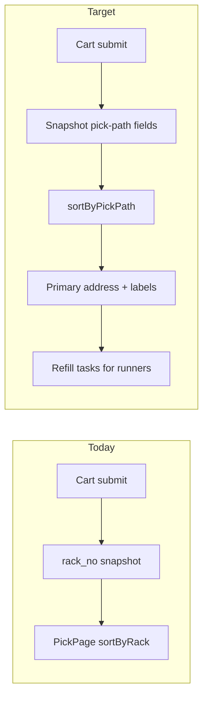

# Integrate slotting, two-bin, and refill into picking

## Current baseline (constraints)

- **Single location**: [`items.rack_no`](supabase/migrations/001_create_tables.sql) and [`order_items.rack_no`](supabase/migrations/001_create_tables.sql) (snapshot at cart submit in [`CartPage.tsx`](src/pages/sales/CartPage.tsx)).
- **Pick order**: [`sortByRack`](src/pages/picking/PickPage.tsx) — `localeCompare` on one string; brand comes from a separate [`items`](src/pages/picking/PickPage.tsx) fetch (`main_group`) for display only, not sort.
- **Roles**: [`AuthContext`](src/context/AuthContext.tsx) and [`users.role`](supabase/migrations/005_work_claims_system.sql) allow `sales | billing | picking | admin` — **no runner**. Order [`work_claims`](supabase/migrations/005_work_claims_system.sql) are **only** for billing/picking **orders**, not a generic task queue.

## 1. Data model (Supabase migration)

**`items`** — add fields so the master encodes the consultant model:

| Column | Purpose |
|--------|---------|
| `pick_floor` | `SMALLINT` (1–3) — walk priority within brand |
| `velocity_class` | `TEXT` check in `A`,`B`,`C` (from ABC analysis / import) |
| `primary_rack_no` | Picker-facing address (migrate from current `rack_no` where null) |
| `reserve_rack_no` | Bulk / floor / overflow — **runners only** for replenishment |
| `primary_min_qty` | Replenish threshold (optional; for auto tasks later) |
| `qty_in_primary` | Optional; **only if** you commit to decrementing on pick/refill — enables auto refill |

Keep `rack_no` for backward compatibility: migration copies → `primary_rack_no`, then app code gradually prefers `primary_rack_no` with fallback to `rack_no`.

**`order_items`** — snapshot at insert (same place as `rack_no` today):

- `primary_rack_no`, `reserve_rack_no`, `pick_floor`, `velocity_class`, `brand_zone` (copy `main_group` at order time)

This freezes the pick path for that order even if master data changes later.

**`refill_tasks`** (new):

- `item_id`, `from_rack`, `to_rack`, `qty_requested`, `qty_moved`, `status` (`pending` \| `in_progress` \| `done` \| `cancelled`)
- `source` (`picker_request` \| `threshold` \| `admin`)
- `created_by`, `assigned_runner`, timestamps, optional `notes`
- RLS: runners read/update assigned/pending; admins full; service role for edge jobs if any

**`users.role`**: extend check constraint to include **`runner`** (and seed names as needed). Update [`008_picker_push_notifications.sql`](supabase/migrations/008_picker_push_notifications.sql)-style checks if push is ever needed for runners (optional).

## 2. Pick-path sort + UI ([`PickPage.tsx`](src/pages/picking/PickPage.tsx))

Replace `sortByRack` with **`sortByPickPath`** on `OrderItem[]`:

1. **`brand_zone`** (localeCompare) — respects brand-zoning.
2. **`pick_floor`** ascending (fast movers on lower floors once data says so).
3. **`velocity_class`** — order `A` then `B` then `C` (missing last).
4. **`primary_rack_no`** — same numeric `localeCompare` as today for shelf walk within aisle.

**Cards**:

- Prominent **primary** address (existing visual weight stays on primary).
- **Reserve** shown in muted text: “Bulk / refill: …” — instructional copy that pickers take from **primary only**; reserve is for runners.
- Small chips: floor, A/B/C, brand — so spatial memory + ABC are visible without a separate doc.

**Metadata fetch**: extend the existing `items` select to include `pick_floor`, `velocity_class`, `primary_rack_no`, `reserve_rack_no` for any join-back if you choose to refresh display from live `items` for non-snapshotted fields (prefer snapshot columns on `order_items` for consistency).

## 3. Order pipeline ([`CartPage.tsx`](src/pages/sales/CartPage.tsx))

When building `orderItems` rows, populate new snapshot columns from each `ci.item` (after you extend [`Item`](src/types/index.ts) and [`useItems`](src/hooks/useItems.ts) select list).

**Billing** ([`ReviewPage.tsx`](src/pages/billing/ReviewPage.tsx)): if new lines are added on approve, same snapshot rules apply for any insert path (grep `order_items` insert — likely only cart today).

## 4. Refill workflow (runner)

- **Auth**: Add `runner` to [`Role`](src/context/AuthContext.tsx), [`ROLE_HOME`](src/App.tsx), [`RoleSelectPage`](src/pages/RoleSelectPage.tsx) (reuse `useTeamUsers('runner')` once `users` has runner rows), [`DevRoleSwitcher`](src/components/dev/DevRoleSwitcher.tsx).
- **Routes**: e.g. `/refill` layout with queue + task detail (mirror patterns from [`QueuePage`](src/pages/picking/QueuePage.tsx) / [`useWorkClaim`](src/hooks/useWorkClaim.ts) but **new hooks** — `useRefillTasks`, `claimRefillTask`, `completeRefillTask` via Supabase RPCs for atomic updates).
- **Picker → task**: On [`PickPage`](src/pages/picking/PickPage.tsx), add **“Request refill”** (or tie to flag reason) calling `insert` into `refill_tasks` with `source: picker_request`, `from_rack: reserve`, `to_rack: primary`, suggested qty from line or default.

**Automatic threshold tasks** (your stated “full” scope): implement only if `qty_in_primary` is maintained:

- Option A — **Lightweight**: no stock split in DB; threshold tasks are **manual/admin-only** or **picker_request** until operation adopts counting primary bins.
- Option B — **Full automation**: on pick line complete or `complete_picking`, decrement `qty_in_primary`; DB trigger or RPC after update creates `refill_tasks` when `qty_in_primary <= primary_min_qty`. This touches [`PickPage`](src/pages/picking/PickPage.tsx) mutations and possibly a small RPC — document as the operational prerequisite.

Recommendation: ship **addressing + snapshot + sort + runner queue + picker-request** first; add **trigger-based threshold** in the same project only if you add `qty_in_primary` + update rules in the same migration batch.

## 5. ABC / Excel analysis

[`Required_Data_Jan.xlsx`](Required_Data_Jan.xlsx) is **not in the repo** — analysis runs offline. Output should land as **`velocity_class` (and optionally `pick_floor`)** on `items` via:

- extension of [`stockImporter.ts`](src/lib/import/stockImporter.ts) / admin upload column mapping, or
- one-off SQL `UPDATE` from CSV.

No change to picking **logic** beyond reading those columns.

## 6. Files likely touched (concise)

| Area | Files |
|------|--------|
| Schema | New migration under [`supabase/migrations/`](supabase/migrations/) |
| Types | [`src/types/index.ts`](src/types/index.ts) |
| Cart snapshot | [`src/pages/sales/CartPage.tsx`](src/pages/sales/CartPage.tsx) |
| Pick sort + UI | [`src/pages/picking/PickPage.tsx`](src/pages/picking/PickPage.tsx) |
| Item list fields | [`src/hooks/useItems.ts`](src/hooks/useItems.ts) |
| Order detail select | [`src/hooks/useOrderDetail.ts`](src/hooks/useOrderDetail.ts) |
| Runner shell | [`src/App.tsx`](src/App.tsx), new pages under `src/pages/refill/` |
| Auth / role | [`src/context/AuthContext.tsx`](src/context/AuthContext.tsx), [`src/pages/RoleSelectPage.tsx`](src/pages/RoleSelectPage.tsx) |
| Docs | [`docs/ARCHITECTURE.md`](docs/ARCHITECTURE.md) — rack/location section only if you keep architecture in sync |

## 7. Risk / rollout

- **Gradual migration**: nullable new columns; default sort falls back to old behavior when `pick_floor` / `velocity_class` missing.
- **Training**: one line of copy on pick cards: “Pick from primary only; bulk location is for refill.”
- **No business stop**: physical labeling + master data import can proceed aisle-by-aisle while software tolerates incomplete data.
