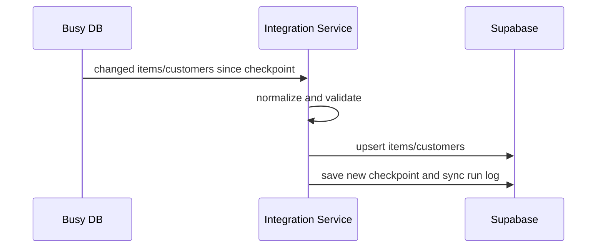
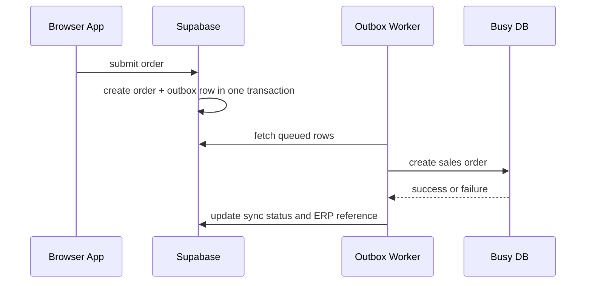

# Busy Database Integration Blueprint

This document describes how to integrate PASPL Master with the Busy database running on a local server so the app can:

- read near-live stock
- read customer and item master data
- write sales orders from the app into Busy
- keep billing/picking workflow responsive
- scale safely as order volume grows

## 1. What The Codebase Does Today

The current app is a browser-first Vite SPA deployed on Vercel and talks directly to Supabase from the client.

Relevant paths:

- [src/lib/supabase/client.ts](/Users/maitreya/pasplmaster/src/lib/supabase/client.ts)
- [src/hooks/useItems.ts](/Users/maitreya/pasplmaster/src/hooks/useItems.ts#L1)
- [src/hooks/useOrders.ts](/Users/maitreya/pasplmaster/src/hooks/useOrders.ts#L1)
- [src/pages/sales/CartPage.tsx](/Users/maitreya/pasplmaster/src/pages/sales/CartPage.tsx#L939)
- [supabase/migrations/011_submit_sales_order_rpc.sql](/Users/maitreya/pasplmaster/supabase/migrations/011_submit_sales_order_rpc.sql)

Important observations:

- The browser currently submits orders by calling `submit_sales_order` directly in Supabase.
- The browser reads item stock from the `items.stock_qty` column.
- The browser fetches the full active item catalog in batches and keeps it cached.
- Orders already use Supabase Realtime to refresh UI state.

This is a good base, but it is not the right place to connect directly to Busy.

## 2. Senior-Level Integration Principle

Do not connect the frontend browser app directly to the Busy database.

Instead, use this architecture:


Why:

- Busy is on a local server, so internet-facing browser clients should not connect to it.
- Busy credentials and write access must stay server-side.
- You need retry logic, audit logs, conflict handling, and idempotency.
- If Busy is slow or offline, your app should still work and queue writes safely.

## 3. Recommended Source Of Truth Model

Use a split-responsibility model:

- Supabase is the app-facing operational store.
- Busy remains the ERP/accounting master system.
- The integration service synchronizes data between them.

Recommended ownership:

- `items`, `customers`, transport/master data:
  Busy -> integration service -> Supabase
- live or near-live stock snapshots:
  Busy -> integration service -> Supabase
- app orders:
  app -> Supabase -> outbox -> integration service -> Busy
- Busy confirmation / ERP document number / sync status:
  Busy -> integration service -> Supabase

This lets the app stay fast while still respecting Busy as the business system.

## 4. Target Write Path For Orders

Today the app does:

1. browser calls `submit_sales_order`
2. Supabase inserts order and decrements stock

Recommended next version:

1. browser submits order into Supabase
2. Supabase creates:
   - `orders`
   - `order_items`
   - `erp_order_outbox`
3. integration service reads unsent outbox rows
4. integration service writes order into Busy
5. integration service marks row as `synced`, `failed`, or `retrying`
6. UI shows sync state on the order

Recommended statuses:

- `draft`
- `submitted`
- `erp_queued`
- `erp_synced`
- `erp_failed`

Recommended outbox fields:

- `id`
- `order_id`
- `idempotency_key`
- `payload`
- `status`
- `attempt_count`
- `last_error`
- `next_retry_at`
- `busy_order_ref`
- `created_at`
- `updated_at`

Why this matters:

- avoids duplicate orders in Busy
- supports retries when local server is offline
- gives visibility when an order failed after app submit

## 5. Target Read Path For Stock

For stock, do not query Busy from the client at search time.

Use a replicated stock model:

1. integration service polls Busy stock deltas every 15 to 60 seconds
2. writes normalized stock snapshot into Supabase
3. app reads stock from Supabase
4. app uses Realtime or selective invalidation for hot screens

If you need tighter freshness, add:

- `last_stock_sync_at` on each item
- a lightweight `inventory_version` counter
- a `stock_events` table for changed SKUs only

This keeps search fast and avoids hammering Busy.

### 5.1 Supabase write path: `apply_erp_items_delta` (migrations 036 + 041)

The integration worker should call the Postgres RPC **`apply_erp_items_delta`** once per sync tick (for example every 60 seconds) with **only changed SKUs**, using the **service role** JWT — **never** ship that key to the browser.

- **Match key:** `items.busy_code` (numeric Busy / ERP item code). The migration ensures `items.busy_code` exists and adds a partial index where it is not null.
- **Payload:** `p_rows` is a JSON array. Each element may include `busy_code` (alias key `busyCode` is accepted), `stock_qty`, `sales_price`, and `mrp`. Omit a field or send an empty string to **leave that column unchanged** in Postgres.
- **Unified stock (recommended):** Optional **`locations`** — a non-empty JSON array of `{ "stock_location": "Main Store", "stock_qty": "10" }` (aliases `stockLocation` / `stockQty` are accepted). Each location string must normalize to **Main Store** or **Jabalpur** per `normalize_stock_location_code` (migration 038). When `locations` is present, the RPC applies **`stock_locationwise`** and **`items.stock_qty`** in **one transaction**: it replaces all `main_store` / `jabalpur` rows for that `busy_code` with exactly two canonical rows (`Main Store`, `Jabalpur`) and sets **`items.stock_qty`** to the **sum** of those two quantities. This keeps the catalog total and per-store rows aligned with the same Busy snapshot. **Do not** also POST separate `stock_locationwise` upserts for the same SKU in the same tick, or you risk racing the RPC.
- **Legacy payload:** If `locations` is omitted, behavior matches migration 036: only `items` columns are updated when values differ (`IS DISTINCT FROM`), which avoids no-op trigger churn. Migration **043** adds an **`AFTER INSERT OR UPDATE OF stock_qty`** trigger on **`items`**: whenever **`items.stock_qty`** changes for a row with **`busy_code`**, Postgres **rewrites** canonical **Main Store** + **Jabalpur** rows in **`stock_locationwise`** so their **sum equals `items.stock_qty`** (same ratio as before when both warehouses had stock; otherwise all quantity goes to Main Store). That keeps the sales UI aligned with what the worker wrote to **`items`** even before you adopt the `locations` payload.
- **Audit:** Each successful call inserts one row into **`inventory_sync_runs`** (`rows_in`, `rows_invalid`, `rows_staged`, `rows_updated`, `rows_not_found`). Optional `p_extra` jsonb is merged into the `extra` column for your own tags (job id, MSSQL checkpoint, etc.). When `locations` is used, `extra` also includes `rows_stock_locations_deleted` and `rows_stock_locations_inserted`; the RPC return jsonb includes the same keys.

**PostgREST example** (curl):

```bash
curl -sS "$SUPABASE_URL/rest/v1/rpc/apply_erp_items_delta" \
  -H "apikey: $SUPABASE_SERVICE_ROLE_KEY" \
  -H "Authorization: Bearer $SUPABASE_SERVICE_ROLE_KEY" \
  -H "Content-Type: application/json" \
  -d '{
    "p_rows": [
      { "busy_code": "1001", "stock_qty": "48", "sales_price": "120", "mrp": "150" }
    ],
    "p_source": "mssql_60s",
    "p_extra": { "checkpoint": "2026-05-13T10:00:00Z" }
  }'
```

**Unified stock example** (same RPC; `stock_qty` on the row is optional when `locations` is present — the RPC sets `items.stock_qty` from the sum of the two warehouses):

```bash
curl -sS "$SUPABASE_URL/rest/v1/rpc/apply_erp_items_delta" \
  -H "apikey: $SUPABASE_SERVICE_ROLE_KEY" \
  -H "Authorization: Bearer $SUPABASE_SERVICE_ROLE_KEY" \
  -H "Content-Type: application/json" \
  -d '{
    "p_rows": [
      {
        "busy_code": "1001",
        "locations": [
          { "stock_location": "Main Store", "stock_qty": "30" },
          { "stock_location": "Jabalpur", "stock_qty": "18" }
        ],
        "sales_price": "120",
        "mrp": "150"
      }
    ],
    "p_source": "mssql_60s"
  }'
```

**Avoid** chaining many `POST /items` upserts from the worker for this loop — use this RPC for a single round-trip and predictable load. Manual spreadsheet imports in the app may continue to use existing batch upsert code paths.

**Freshness:** With ERP updates every 60 seconds and the SPA polling item deltas every 30 seconds (`updated_at` watermark in `useItems`), operators still see stock within roughly half a minute of a real change landing in Postgres.

## 6. Minimum Backend You Should Add

This repo currently has no dedicated backend service outside Supabase, so the senior approach is to add one.

Recommended deployment location:

- same machine as Busy server, or
- same LAN as Busy server with private DB access

Recommended responsibilities:

- read Busy items/customers/stock
- write sales orders to Busy
- maintain checkpoints for incremental sync
- retry failures with backoff
- expose health metrics

Suggested implementation options:

- Node.js worker with cron or queue processing
- Supabase Edge Functions can help for orchestration, but not if Busy is only reachable on the LAN
- best practical setup: small Node service on the local server side

Suggested folder if you want to build it in this repo later:

- `server/busy-sync/`

## 7. Database Objects To Add In Supabase

Add integration tables instead of mixing sync metadata into business rows only.

Recommended new tables:

- `erp_order_outbox`
- `erp_sync_checkpoints`
- `erp_sync_failures`
- `inventory_sync_runs` (implemented: migration 036 + written by `apply_erp_items_delta`)
- `customer_sync_runs`
- `item_sync_runs`

Recommended columns on existing rows:

- `orders.erp_sync_status`
- `orders.erp_synced_at`
- `orders.erp_reference_no`
- `orders.erp_last_error`
- `items.stock_last_synced_at`
- `items.stock_source`

Recommended indexes:

- `erp_order_outbox(status, next_retry_at)`
- `orders(erp_sync_status, created_at desc)`
- `items(updated_at desc)`
- `items(stock_last_synced_at desc)`

## 8. Anti-Corruption Layer For Busy

Do not spread Busy-specific field names through the frontend.

Create a translation layer in the integration service:

- Busy item code -> app item id / alias / searchable fields
- Busy party ledger -> customer row
- Busy sales voucher schema -> normalized app order payload

This keeps PASPL Master clean even if Busy data is messy or changes format.

Recommended rule:

- frontend knows app models
- sync service knows both app models and Busy models

## 9. Performance Priorities

### 9.1 Biggest current frontend hotspot

[src/hooks/useItems.ts](/Users/maitreya/pasplmaster/src/hooks/useItems.ts#L10) loads the full active catalog in 1000-row batches into the browser.

That is workable at your current size, but it will become expensive as stock fields, search metadata, and devices grow.

Recommended improvement path:

1. keep current preload for short term
2. add a server-side search RPC for item lookup
3. return only the first page of best matches
4. keep client-side cache for recently used items and top sellers

Good hybrid strategy:

- preload top 500 to 1500 frequently ordered items
- search the long tail on demand
- sync stock deltas only for changed items

### 9.2 Avoid over-broadcasting realtime

[src/hooks/useOrders.ts](/Users/maitreya/pasplmaster/src/hooks/useOrders.ts#L96) invalidates the whole orders query tree on every order or claim change.

That is fine now, but later you should:

- subscribe by workflow or by date window where possible
- update specific query keys instead of invalidating everything
- use lighter list projections for dashboard screens

### 9.3 Protect stock correctness

Current order submit already uses row locks in Postgres via `FOR UPDATE`, which is good.

Once Busy is introduced, also decide how reservation works:

- reserve stock in Supabase immediately for app UX
- then push order to Busy
- if Busy rejects or changes quantities, raise an exception workflow instead of silently mutating

Do not let both systems decrement stock independently without reconciliation rules.

## 10. Recommended Integration Flows

### 10.1 Item and customer sync



### 10.2 Sales order write



## 11. Failure Handling Rules

Treat failures as a first-class feature, not an edge case.

You need:

- idempotency key per order submit
- retry with exponential backoff
- dead-letter visibility after repeated failure
- operator dashboard for failed syncs
- manual requeue action
- full payload audit log

Examples:

- Busy server offline
- duplicate voucher number
- customer missing in Busy
- item code mismatch
- stock changed between sync windows

## 12. Security Rules

Never expose Busy credentials to the browser.

Required controls:

- integration service uses server-only secrets
- app users never connect directly to Busy
- service-to-service auth between local sync service and Supabase
- write operations logged with actor, payload hash, and timestamp

## 13. Practical Rollout Plan

### Phase 1: Stabilize current app boundary

- keep Supabase as the only thing the frontend talks to
- add `erp_sync_status` fields on orders
- add outbox tables
- add admin screen for sync visibility

### Phase 2: Build local integration service

- read Busy item/customer/stock deltas
- push app orders from outbox into Busy
- update Supabase with sync results

### Phase 3: Performance upgrades

- move item search to RPC/server-side search
- send only changed stock rows, not full refreshes
- create smaller read models for dashboards

### Phase 4: Reconciliation and trust

- nightly reconciliation job between Busy and Supabase
- detect stock mismatch, missing orders, pricing mismatch
- produce exception reports for staff

## 14. Concrete Changes I Would Make Next In This Repo

If I were implementing this as the senior engineer on the project, I would do these next:

1. Add Supabase schema for ERP sync state and outbox.
2. Change sales submit so it records ERP sync status explicitly.
3. Add admin UI for `queued`, `failed`, and `synced` ERP orders.
4. Add a local sync worker beside the Busy server.
5. Replace full-catalog browser loading with hybrid search before the item table grows much larger.

## 15. Final Recommendation

The safest and most scalable design is:

- frontend app <-> Supabase only
- local integration service <-> Busy only
- order writes use an outbox
- stock reads use replicated snapshots plus incremental sync
- reconciliation catches drift

That gives you:

- fast UI
- safe writes
- recoverability when Busy is offline
- much better visibility for operations
- room to grow without rewriting the frontend later
