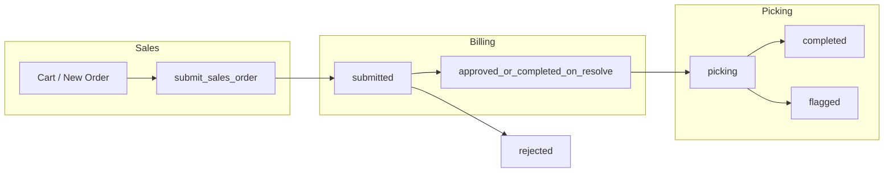
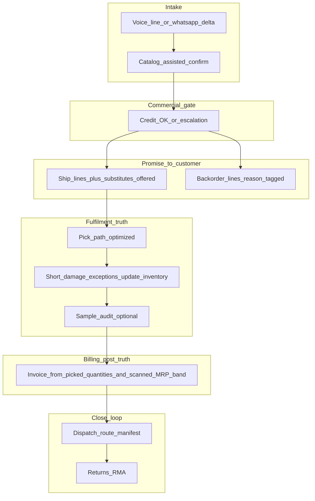

# Operations Flow — Business Analyst Findings

Generated: 2026-05-18 (Asia/Kolkata).

**Audience:** CEO / business owner.  
**Purpose:** Map PASPL Master’s **actual** order-to-cash flow against an external operations critique, score recommendations by impact and effort with directional INR, and propose a 90-day roadmap. Engineering references are confined to appendices.

**Declared operating scale (from internal architecture docs):** ~12,500 SKUs, ~3,200 customers, ~200–250 orders/day, ~₹20 lakh/day throughput.

---

## 1. Executive summary

### The strategic frame

Salespeople are hired and incentivised like **relationship owners and closers**, but the current workflow trains them as **catalog typists**. Order intake forces parallel cognitive load: decode Hindi/Hinglish + technical parts language, search a large SKU base, and maintain a structured cart — during a live call. Faster search alone does not fix that; it only shortens one leg of a three-legged race.

Every structural recommendation below (substitution, sequence change, credit discipline, demand signals) is really asking one question: **what should humans do, and what should the system do?** The system should own lookup, stock truth, credit gates, and substitute suggestions; humans should own confirmation, exceptions, and revenue recovery.

### Top three moves (ranked by directional INR impact)

Assumptions used for order-of-magnitude only (validate with 30 days of tagged events once instrumentation exists):

| Rank | Move | One-line rationale | Directional INR impact |
|------|------|-------------------|------------------------|
| **1** | **Substitution at point of OOS** | Auto parts distribution converts stockouts into alternate-brand or cross-reference sales when the substitute is *shown*, not when the customer hears “no stock.” | **High recurring upside.** If even **15–25%** of OOS line-events convert to substitute lines at typical distributor gross margin, recovered contribution on **₹20L/day** throughput can land in the **₹8–25 lakh / month** band — highly sensitive to actual OOS rate and substitute acceptance; measure before promising a number to the board. |
| **2** | **Invert sequence to pick-confirmed truth → bill** | Billing after picker confirms carton MRP, quantity, and condition removes mid-pick price pop-ups and a class of customer disputes (“you billed X, box says Y”). | **Medium–high:** fewer billing interruptions, fewer credit notes/adjustments, faster picker throughput. Worth **₹2–8 lakh / month** in avoided rework + faster cash conversion if dispute/write-off rate is material today — quantify via billing rework hours and invoice corrections. |
| **3** | **Credit gate at order entry** | B2B India requires blocking or escalating orders when the party is over limit or overdue; protects the firm *and* the salesperson from silent exceptions. | **Risk avoidance dominant:** bad-debt and “busy fulfilling uncollectible orders” leakage often runs **0.5–2%** of credit sales for distributors without hard gates — directional **₹5–20 lakh / month** *at risk prevented* on ₹5–6 crore monthly throughput scales only if credit sales share is high; needs Busy/outstanding feed to tighten the estimate. |

### What not to build yet (and why)

| Idea | Why defer |
|------|-----------|
| **Auto-add every OOS line to a PO** | Turns procurement into a reflex; ignores MOQ, dying SKUs, and aggregation across customers. Creates liability inventory. |
| **Big-bang “record every call” rollout** | Correct direction for evidence and async entry, but needs consent policy, retention, storage cost, and optionally transcription — **sequence behind** push-to-talk per line and WhatsApp delta flows. |
| **Weight-based verification at pick** | Requires trustworthy per-SKU weight master and calibrated scales on every cart — CapEx + maintenance before payoff. |
| **Full predictive replenishment (“demand sensing”)** | Valuable at maturity, but worthless without clean demand signals (substitution tagging, cancel vs backorder reasons, lost margin). Build the **signal queue first**. |

---

## 2. Current operations flow (AS-IS)

The live product implements a **linear pipeline**: Sales submits → Billing approves → Picking executes → order reaches **completed** (or **flagged** / **rejected**). There is **no discrete “checking” workflow stage**, **no route-planning stage**, and **dispatched** exists as a timestamp concept in schema—not as a first-class workflow step wired through the same state machine.

### AS-IS state machine (what the software actually enforces)

**Annotations — gaps visible on the diagram:**

- No **checking** node between picking and handoff.
- No **dispatch / route consolidation** node after completion.
- **dispatched_at** may exist on data model but is not the same as a guided operational stage in-app.
- **Returns** are not part of this graph.

### Stage-by-stage narrative (plain language)

**Sales — intake & cart**

- Sales builds lines via catalog search (and related shortcuts such as quick-reorder signals). Out-of-stock behaviour today splits lines into **ship vs PO-at-checkout** logic rather than turning the moment into a guided substitute sale.
- Submit persists the order and lands it in **billing’s queue** as **submitted**.

**Billing — review & approve**

- Billing validates quantities, prices vs system, transport, and flags problematic lines. Approval transitions the order toward warehouse readiness; some flows resolve flags without sending everything down the pick path (implementation-specific branches exist).
- This stage **fixes commercial truth before the warehouse runs** — which is why **carton MRP mismatches** surface as billing/picker friction later.

**Picking — claim & execute**

- A picker **claims** an approved order, walks locations (typically rack-ordered), verifies lines via scan/OCR/manual paths, and marks lines **picked** or **flagged** (out of stock, damaged, price mismatch, etc.).
- Flags can spawn **pending_items** for recovery workflows — useful backbone, but not yet the full “backorder vs lost sale vs cancelled” vocabulary the critique asks for.

**After picking**

- Order reaches **completed** when picking closes successfully; **flagged** captures exception-heavy outcomes.
- **Sales-facing visibility** exists at coarse workflow status (e.g. submitted / approved / picking / completed) but not fine-grained warehouse substeps like “at checking” or “manifested for route.”

---

## 3. Critique triage — scoring external recommendations

Verdict legend: **U** = Right and urgent · **L** = Right but later · **P** = Partial — adopt a narrower version · **W** = Wrong or misleading as stated.

### Order intake

| ID | What they said | Verdict | Why (concise) | INR / productivity direction |
|----|----------------|---------|----------------|------------------------------|
| Intake-1 | Record every call by default; async entry after hang-up | **L** | Principle aligns with serious telesales ops; implementation burden (consent, storage, review UX) is heavy for v1. | Productivity + quality **after** workflow buy-in; INR upside via fewer errors/disputes — secondary to substitution/credit. |
| Intake-2 | Push-to-talk per line item | **U** | Ships incremental value without forcing full async ops; reduces typing during conversation. | Hours saved per rep/day; fewer wrong-SKU orders — medium recurring upside. |
| Intake-3 | WhatsApp “repeat last order ± deltas” for repeat buyers | **P** | Strong fit given **~62.8% repeat** narrative; must target **top cohort** first to avoid bot chaos. | Moves order capture off phone for a wedge of volume — **high leverage** on subset of customers. |

### Out-of-stock → procurement → cockpit

| ID | What they said | Verdict | Why | INR direction |
|----|----------------|---------|-----|----------------|
| OOS-1 | Replace auto-PO reflex with **demand signal queue** + purchaser decision | **U** | Matches how buyers actually think (MOQ, velocity, relationship). | Avoids **inventory rupees** tied in dead SKUs; improves fill rate on winners. |
| OOS-2 | Substitution at order entry | **U** | Primary revenue recovery lever in parts distribution. | **Largest revenue/margin upside** in this entire critique. |
| OOS-3 | Cockpit KPIs: frequency, **lost margin**, substitution offered/accepted, days-of-cover, repeat impact | **U** | “Sale loss ₹” on MRP overstates pain; margin + behaviour KPIs drive decisions. | Better capital allocation; measurable ROI on purchasing and coaching. |

### Order → billing → picking sequence

| ID | What they said | Verdict | Why | INR direction |
|----|----------------|---------|-----|----------------|
| Sequence-1 | Pick truth first → bill (draft bill, tolerance on MRP variance) | **U** | Removes synchronous billing interruption mid-pick and aligns invoice to physical reality. | Dispute reduction + labour savings at billing; faster billing throughput. |

### Picking mechanics

| ID | What they said | Verdict | Why | INR direction |
|----|----------------|---------|-----|----------------|
| Picking-1 | Multi-order batch + **path sort by location**, reassemble bins by scan | **L** | Correct WMS pattern; requires UX + queue logic investment. | Walk-time reduction **30–50%** *if* batches are stable — validate with time-motion study. |
| Picking-2 | Measure mis-pick **before** mandatory rack scan | **U** | Prevents “security theatre” steps that slow picks without error reduction. | Labour minutes saved; avoids false confidence. |
| Picking-3 | Short-pick + damaged: one-tap adjust + reroute | **U** | Happens daily at scale; without it, inventory truth drifts and customer promises break. | Fewer blind backorders; cleaner stock records. |

### Checking / verification model

| ID | What they said | Verdict | Why | INR direction |
|----|----------------|---------|-----|----------------|
| Checking-1 | Choose among full re-scan, weight verify, or **sample audit** | **P** | **Sample audit** first — realistic at current scale & tooling maturity; full re-scan is often overkill; weight needs master data + hardware. | Balance labour cost vs accuracy; avoid FC-grade capex prematurely. |

### Pending / recovery UX

| ID | What they said | Verdict | Why | INR direction |
|----|----------------|---------|-----|----------------|
| Pending-1 | Separate **backordered** vs **cancelled** + forced cancel reason | **U** | Forecasting and accountability diverge completely without this split. | Cleaner demand signals → better buying → rupees recovered indirectly. |

### “Missing entirely” (today vs needed)

| Topic | Verdict | INR / risk direction |
|-------|---------|----------------------|
| Returns | **U** (missing) | Auto parts **will** return; without workflow, margin leaks via informal adjustments. |
| Credit check at order entry | **U** (missing) | Bad debt & shipment risk — see Executive INR #3. |
| Route / dispatch consolidation | **U** (missing) | Logistics cost & OTIF; reduces chaos at dispatch desk. |
| Demand sensing / predictive replenishment | **L** | Premature without clean signals — build **after** queue + reasons + substitution tagging. |
| Allocation rules on tight stock (A-tier wins) | **P** | Needs explicit policy to avoid politics; high value **once** shortage frequency is material. |
| Salesperson order-status visibility | **P** (partial) | Coarse statuses exist; needs **granularity** (“picked”, “at QC”, “on manifest”) to kill status phone calls. |

---

## 4. Where the critique is incomplete or overstated

**Call recording as default**

- Directionally correct for dispute handling and training data.
- **Rollout reality:** consent logging, storage lifecycle, retrieval UX, and optionally transcription cost. Treat as **phase 2–3** after push-to-talk + WhatsApp deltas prove adoption.

**Three checking models presented as equals**

- At ~200–250 orders/day and **early barcode coverage**, **full double-scan for every line** is usually uneconomic.
- **Weight verification** is an infrastructure programme, not a feature flag.
- **Risk-weighted sample audit** (by picker tenure, SKU value, customer tier) matches distributor economics.

**Substitution KPI before substitution UX**

- Measuring “substitution acceptance rate” is meaningless until substitutes are **systematically offered** and tracked per event.

---

## 5. Impact × effort matrix

### Do now — high impact, lower incremental effort

- Substitution surface at OOS (start manual / rules-based cross-reference table).
- Sales-facing **sub-stage** visibility for order tracking.
- Pending semantics: **backordered vs cancelled** + mandatory cancel reasons.
- Policy for **MRP variance tolerance** (even before full pick→bill inversion).
- Short-pick / damaged quick paths tied to inventory adjustment rules.

### Plan next quarter — high impact, higher effort

- **Pick-confirmed billing** (structural sequence change across RPCs/UI).
- Demand-signal queue feeding purchasing (ranked scorecard).
- Credit gate wired to outstanding/limit source (Busy integration).

### Quick wins — moderate impact, contained effort

- Push-to-talk per line capture prototype on sales devices.
- Pilot **location-first pick paths** on a subset of SKUs or zones.
- Cockpit redesign around section 6 KPIs (even if first version is spreadsheet-fed).

### Defer / drop — costly relative to payoff *today*

- Omnichannel call recording archive without governance.
- Scale-per-SKU weight verification programme.
- ML forecasting layer before reason-coded demand history exists.

---

## 6. KPIs the cockpit actually needs

Below: **six CEO-grade KPIs** with explicit definitions. “Data source today” indicates what can be approximated immediately vs what needs new fields/events.

### KPI 1 — Lost **margin** at stockout (not MRP)

- **Numerator:** Σ (expected unit margin ₹) × unfulfilled qty for stockout events in period. Expected margin = system sale price minus landed cost proxy (or gross margin % from finance if cost feed exists).
- **Denominator:** Same summation across **all** line attempts OR sold lines — pick one baseline and never flip without noting it.
- **Source:** `order_items` flags + pending/backorder records + pricing snapshots; **needs** consistent cost/margin tagging.

### KPI 2 — Stockout **events per SKU per month**

- **Numerator:** Count of discrete stockout-line events (sales OOS + pick OOS + billing OOS) after deduplication rules.
- **Denominator:** Active SKU-months or total lines — report both until stable.
- **Source:** Flags + pending_items timestamps.

### KPI 3 — Substitution **offered rate** and **acceptance rate**

- **Offered:** `substitute_offered_events / oos_events`.
- **Accepted:** `substitute_accepted_lines / substitute_offered_events`.
- **Source:** **requires new logging** at sales tap-level (cannot infer reliably post hoc).

### KPI 4 — Days-of-cover at stockout

- **Definition:** On-hand ÷ trailing daily usage at moment of stockout event (usage from shipments or picks).
- **Why:** Separates “supplier surprise” from “we should have reordered.”

### KPI 5 — Repeat / tier impact

- **Examples:** % of OOS margin lost on **A-tier** customers; repeat-customer fill-rate vs one-offs.
- **Source:** `customers` tier tags (needs explicit segmentation discipline).

### KPI 6 — Pick exception rate & ageing

- **Numerator:** Flags + short-picks + damages + reversals.
- **Denominator:** Picked lines or orders.
- **Aging:** Pending recovery backlog days — early warning before relationship damage.

---

## 7. Ninety-day prioritized roadmap

Each phase lists **initiatives**, **success signal**, and **kill switch** (when to stop funding the bet).

### Days 1–30 — stop revenue leakage on stockouts

| Initiative | Success signal | Kill switch |
|------------|----------------|-------------|
| Substitution panel at OOS (rules/manual first) | ↑ lines saved from pure cancel; pilot cohort sees measurable substitute attach | Sales ignores panel (<10% engagement after coaching) |
| Finer status labels on salesperson order tracker | ↓ “where is my order?” escalations by **25%+** in pilot week | No measurable drop in repeat calls |
| Backordered vs cancelled + forced cancel reasons | Clean charts on lost reasons; forecasts stop swinging randomly | Data entry abandons fields → enforce flows |

### Days 31–60 — structural reliability

| Initiative | Success signal | Kill switch |
|------------|----------------|-------------|
| Draft bill → picker-confirmed invoice truth | Price mismatch flags ↓; billing rework hours ↓ | Pick times ↑↑ without invoice accuracy gain |
| Demand-signal queue for purchasing | Fewer emergency buys; higher hit-rate on top movers | Purchasers bypass queue → junk signals |
| Credit gate at entry | Zero shipments to hard-stop accounts without override audit | Integration fragility blocks orders > acceptable threshold |

### Days 61–90 — platform & logistics completeness

| Initiative | Success signal | Kill switch |
|------------|----------------|-------------|
| Returns (RMA) minimal viable flow | Returns stop bypassing system | Ops refuses adoption |
| Dispatch grouping / route manifest | Fewer partial shipments; measurable km/time saved | Drivers ignore manifests |
| Push-to-talk line capture | Faster order entry on noisy calls | Accuracy drops vs typing baseline |

---

## 8. Salesperson role redesign — the strategic question

**Salesperson today**

- Listens to rapid-fire Hindi/Hinglish + part slang.
- Types into structured rows while searching ~12.5k SKUs.
- Says “out of stock” and loses the line unless personally inventive.

**Salesperson tomorrow**

- Confirms intent (“read-back”) with **system-assisted** SKU picks.
- Sees **credit status** before promising fulfilment.
- Gets ranked **substitutes** when primary is thin or zero.
- Earns recognition on **recovery metrics** (substitute acceptance, A-tier saves), not raw order count.

**Their dashboard should answer**

- Yesterday’s **OOS recovery rate** and margin saved.
- Which **top accounts** have pending backorders or chronic stockouts.
- **Their** pipeline orders by operational stage — actionable without calling the warehouse.

---

## 9. Target operating flow (TO-BE) — conceptual

Not a commitment to build everything at once; this is the **north-star sequence** aligned with the critique + distributor economics.

---

## Appendix A — AS-IS engineering grounding (for implementation teams)

When execution begins, start navigation here:

- **Types / workflow labels:** `src/types/index.ts`
- **Work-claim / billing / picking RPCs:** `supabase/migrations/005_work_claims_system.sql` (`complete_billing`, `claim_order`, `complete_picking`, etc.)
- **Sales:** `src/pages/sales/NewOrderPage.tsx`, `src/pages/sales/CartPage.tsx`, `src/lib/cartSupply.ts`, `submit_sales_order` RPC (`supabase/migrations/011_submit_sales_order_rpc.sql` and successors)
- **Billing:** `src/pages/billing/ReviewPage.tsx`, `src/pages/billing/LiveQueuePage.tsx`, `src/lib/billing/completeBilling.ts`
- **Picking:** `src/pages/picking/PickPage.tsx`, `src/utils/constants.ts` (`FLAG_REASONS`)
- **Pending / recovery:** `src/pages/sales/PendingRecoveryPage.tsx`, `src/hooks/useSalesPendingRecovery.ts`, `pending_items` migrations
- **Supply / PO lens:** `src/pages/admin/SupplyDemandPage.tsx`, `src/hooks/useOpenPoDemandLines.ts`

---

## Appendix B — What already exists (avoid rework)

- **Quick reorder signal:** `get_customer_quick_reorder_stats` — reuse as UX anchor for repeat-customer acceleration.
- **PO split on submit:** cart supply split logic — precursor to richer demand signalling.
- **Pending recovery backbone:** `pending_items` + notifications — extend semantics rather than replacing.
- **Price mismatch mechanics:** `flag_box_price` / billing checks — reuse under a pick-first billing model.
- **Sales order visibility:** Realtime-backed lists — extend labels rather than building parallel messaging.

---

## Closing note

This document is deliberately **analysis-only**. The next step — if leadership agrees with the ranked bets — is a **thin implementation spec** for Initiative #1 (substitution + tagging) and Initiative #2 (status granularity + pending semantics), delivered as engineering tickets with acceptance tests.
