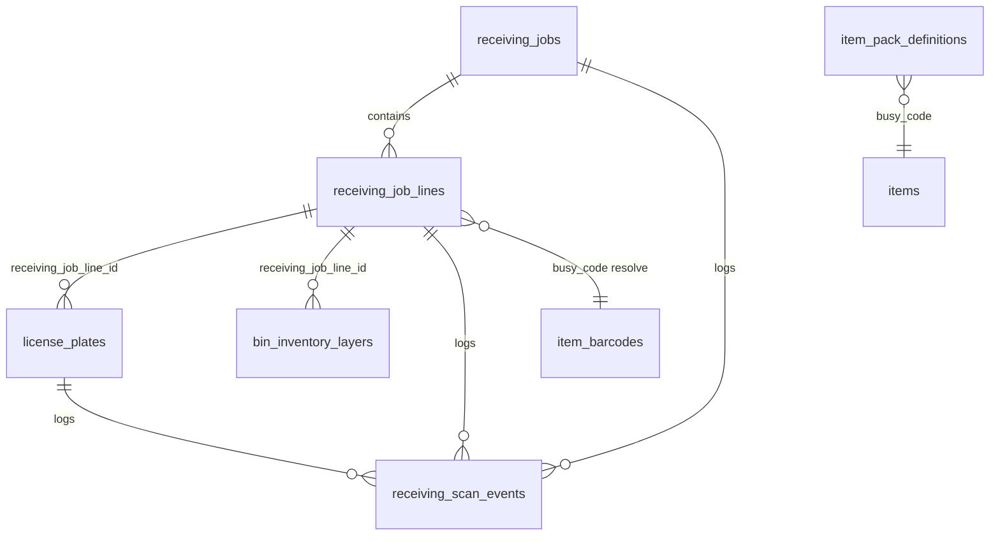
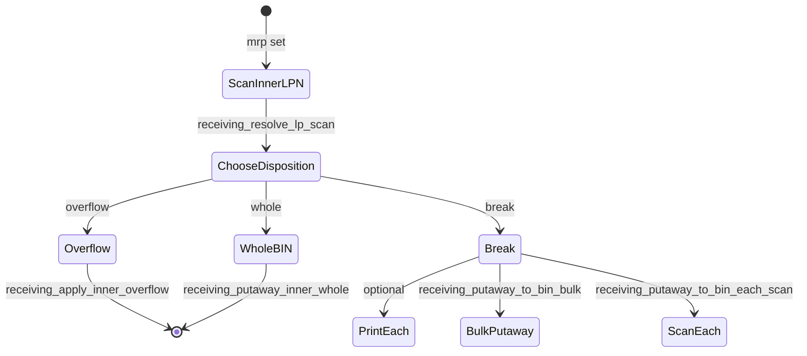

# Receiving Job Detail Page — Senior Dev Audit

**Route:** `/admin/receiving/:jobId`  
**UI:** `src/pages/admin/receiving/ReceivingJobDetailPage.tsx` (stepper + GRN)  
**List:** `src/pages/admin/receiving/ReceivingJobsPage.tsx` (Warehouse hub)  
**Components:** `src/components/receiving/ReceivingStepper.tsx`, `ReceivingGrnTable.tsx`, `ReceivingGrnLineCard.tsx`  
**Workflow:** `src/lib/receiving/receivingWorkflow.ts`  
**API:** `src/lib/receiving/receivingApi.ts`  
**Migrations:** `057`–`060`, `064`, `065`, `068` (+ `056` pack definitions)

This document explains how the receiving detail page works end-to-end: user workflow, React data flow, database schema, RPC contracts, and known gaps.

---

## 1. Executive summary

Receiving models **inbound stock as a job** with **GRN lines per SKU/lot**. The detail page is a **guided stepper** (not one long scroll):

| Step | Route `?step=` | Operator action |
|------|----------------|-----------------|
| **Truck** | `truck` | Confirm dock (`dock_arrived_at`), optional ASN / dock note |
| **Count + labels** | `count` | GRN table: expand line → master (0 ok) → inner packs → piece stickers → **Save & print all** |
| **MRP** | `mrp` | MRP/ea per GRN line (required before putaway) |
| **Putaway** | `putaway` | `PutawayScanWizard` per structured line; loose shows BIN summary |

**Label-plan UI** (`ReceivingGrnLineCard`): warehouse-entered **outer / inner / piece label counts**; **pcs per inner**; optional **inners per outer** when masters &gt; 0. `receive_mode` derived from master count (no mode dropdown).

**License plates (`license_plates`)** are the label instances. **Bin inventory layers (`bin_inventory_layers`)** are MRP-aware stock batches created at putaway.

**Total EA estimate** (PO rollup): `piece_labels + inner_labels × pcs_per_inner` (does not assume every outer is a full pack).

Example: 30 outer labels, 5 inner labels, 25 piece labels, 20 pcs/inner → ≈ 25 + 5×20 = **125 pcs** for PO compare.

### Unified carton stickers (pick + receiving)

Each printed master/inner label shows:

- **Pack QR:** `PASPL-PACK:{busy}:outer|inner` (same as Label Studio)
- **Item QR:** `alias1` or `alias` pick code
- **LPN text:** `license_plates.lpn_code` for WMS trace (not the primary scan target on the floor)

Putaway accepts **PASPL-PACK inner** when exactly one open inner exists on the job line; otherwise the operator picks from a list or scans the LPN.

### STAGING default bin

SKUs without `items.rack_no` default putaway to **`STG-DEFAULT`**. Bin onboarding can **promote** layers from `STG-*` to a real bin via `wms_promote_staging_layer`.

---

## 2. Navigation and entry


| Step | Code | DB |
|------|------|-----|
| List jobs | `ReceivingJobsPage` → `fetchReceivingJobs()` | `SELECT * FROM receiving_jobs ORDER BY created_at DESC` |
| Create job | `createManualArrivalJob()` | `create_receiving_job_manual_arrival` |

**Job header defaults (manual arrival):**

- `triggered_by = 'MANUAL_ARRIVAL'`
- `source_ref = 'WALK-IN'` (overridable)
- `qty_basis = 'CONFIRMED'`
- `receive_status = 'MATCHED'` (placeholder; not driven by UI yet)
- `job_public_id = 'PJ-' || lpad(id, 8, '0')`
- `envelope_code = 'ENV-PJ-' || lpad(id, 8, '0')`

Future: `INVOICE` / `PO` triggers will create jobs from Purchase; `INVOICE` will block on `supplier_code_status != 'MAPPED'`.

---

## 3. Page layout (stepper)

Sticky `ReceivingStepper` + **one step body** at a time. Step gating: `src/lib/receiving/receivingWorkflow.ts` (`isStepComplete`, `canAdvanceToStep`).

| Step | UI | Primary writes |
|------|-----|----------------|
| Truck | Dock confirm | `receiving_confirm_dock_arrival` → `dock_arrived_at` |
| Count | `ReceivingGrnTable` + add line | `receiving_job_lines`; `receiving_print_master_labels` / `receiving_print_inner_labels`; bulk print |
| MRP | `MrpGrnRow` per line | `mrp_per_ea` |
| Putaway | `PutawayScanWizard` | putaway RPCs → `bin_inventory_layers` |

**Legacy note:** `ReceivingSkuCard.tsx` remains but is superseded by `ReceivingGrnLineCard`.

| # | Old section (removed) | Primary writes |
|---|---------------|----------------|
| 1 | Gate — challan & master labels | `receiving_job_lines` INSERT; `receiving_print_master_labels` |
| 2 | Sort — ratio & inner labels | `receiving_job_lines` UPDATE (ratio); `receiving_print_inner_labels` |
| 3 | Verification — PO / challan (human) | `receiving_job_lines` UPDATE (PO + MRP fields) |
| 4 | Putaway — scan-first (MRP layers) | RPCs → `bin_inventory_layers`, `license_plates`, `receiving_scan_events` |

**React Query keys:**

- `['receiving', 'job', jobId]` — header
- `['receiving', 'job', jobId, 'lines']` — lines
- `['receiving', 'plates', lineId]` — invalidated after print/putaway

**Catalog dependency:** `PACK_DEFINITIONS_QUERY_KEY` → `item_pack_definitions` for nominal pack sizes, `sell_unit`, `supplier_type`.

---

## 4. Database model

### 4.1 Entity relationship



### 4.2 `receiving_jobs`

| Column | Role |
|--------|------|
| `id` | Internal PK |
| `job_public_id` | Human ID `PJ-00000001` |
| `envelope_code` | Physical envelope sticker `ENV-PJ-...` |
| `triggered_by` | `MANUAL_ARRIVAL` \| `PO` \| `INVOICE` |
| `source_ref` | Challan / walk-in reference |
| `qty_basis` | `CONFIRMED` \| `SPECULATIVE` |
| `receive_status` | `PENDING` \| `MATCHED` \| `SHORT` \| `OVER` (not wired in UI) |
| `po_ref`, `asn_ref` | Future Purchase linkage |
| `reprint_of_job_id` | Reprint lineage |

### 4.3 `receiving_job_lines` (core state machine per SKU)

| Column | Gate | Sort | Verification | Putaway |
|--------|------|------|--------------|---------|
| `busy_code`, `sku_description_snapshot` | Set on add | — | — | — |
| `lot_no` | Set on add | — | — | Copied to layers |
| `receive_mode` | `structured` \| `inner_only` \| `loose` | — | — | Loose skips putaway wizard |
| `master_carton_qty` | Gate count | Editable until master print | — | — |
| `inner_per_master` | Prefill from catalog | **Confirmed** inners per master | — | — |
| `inner_pack_count` | 0 until sort | **Total inner labels** | — | — |
| `ea_per_inner` | Prefill from catalog | **Confirmed** EA per inner | — | On inner LPN `pack_qty` |
| `total_ea` | Computed | `inner_pack_count × ea_per_inner` (or loose) | — | — |
| `nominal_outer_qty`, `nominal_inner_qty` | Snapshot from `item_pack_definitions` | For `ratio_matches_master` flag | — | — |
| `master_labels_count`, `inner_labels_count` | Computed | Recomputed on ratio save | — | — |
| `each_labels_count` | Always **0** at job | Still 0; each on break only | — | — |
| `master_labels_printed_at` | Set by RPC | Locks master qty field | — | — |
| `inner_labels_printed_at` | — | Set by RPC; locks ratio | — | — |
| `ratio_verified_at` | — | Set on "Save confirmed ratio" | — | Required before inner print |
| `mrp_per_ea`, `invoice_rate_per_ea` | — | — | UI blur-save | **Required** for putaway RPCs |
| `po_verification_*` | — | — | Human checklist | — |
| `supplier_code_*` | Resolved on add | — | — | Printed on labels |
| `sell_unit_snapshot` | `EACH` \| `PACK` \| `BOTH` | — | — | `PACK` blocks each labels on break |
| `dock_damage_note` | Optional per line | — | — | — |
| `loose_target_bin_id` | — | Loose mode only | — | Also calls `submitBinCount` |

**Timestamps (label pipeline):**

- `master_labels_printed_at` — gate complete
- `inner_labels_printed_at` — sort complete
- `labels_printed_at` — legacy; set when inners print (backfill from old combined flow)

### 4.4 `license_plates` (receiving extensions)

Receiving reuses the existing LPN table with nullable receiving columns:

| Column | Meaning |
|--------|---------|
| `receiving_job_line_id` | FK to line; NULL = legacy/non-receiving LPN |
| `receiving_lot` | Lot printed on label |
| `receiving_pack_seq` | Sequence within line (masters then inners continue seq) |
| `receiving_lp_state` | `printed` → `overflow` \| `broken` \| `sold_whole` \| … |
| `receiving_putaway_ea_remaining` | After break: eaches left to put away |
| `invalidated_at` | Superseded label (reprint policy) |
| `overflow_location_bin_id` | `OVF-*` staging |
| `pack_type` | `outer` (master) or `inner` |
| `pack_qty` | Eaches in that physical pack |

**LPN code schemes:**

- **Master:** `M-{jobPublicIdSansDash}-{lineNo}-{i}` (deterministic, job-local)
- **Inner:** `generate_lp_code()` (global unique)

**`pack_qty` on insert:**

- Master RPC: `inner_per_master × ea_per_inner` (catalog estimate at gate; may differ from post-sort ratio until line updated)
- Inner RPC: `ea_per_inner` from **confirmed** line after sort

### 4.5 `receiving_scan_events` (audit ledger)

| `event_type` | When |
|--------------|------|
| `inner_to_overflow` | Overflow disposition |
| `inner_break` | Carton opened for piece pick |
| `bin_stock` | Putaway to shelf (whole/bulk/each) |
| `master_carton_in` | Reserved (not used in current UI) |
| `bin_pick` | Picker consumption (separate flow) |

### 4.6 `bin_inventory_layers` (Phase 2 stock)

Created by putaway RPCs via `wms_apply_bin_layer_delta`:

| Column | Role |
|--------|------|
| `bin_id` | Normalized rack slot |
| `sku_busy_code` | SKU |
| `qty_ea` | Quantity in layer |
| `mrp_per_ea` | From `receiving_job_lines.mrp_per_ea` |
| `lot_no` | From line |
| `receiving_job_line_id` | Traceability |
| `source_license_plate_id` | Which inner LPN fed the layer |
| `fifo_received_at` | FIFO ordering for picks |

**Merge rule:** Same `(bin_id, sku_busy_code, mrp_per_ea, lot_no, receiving_job_line_id)` merges qty; then `wms_recompute_bin_inventory_rollup` updates aggregate `bin_inventory.loose_ea_qty`.

### 4.7 `item_pack_definitions` (catalog nominal)

| Column | Maps to UI / logic |
|--------|---------------------|
| `outer_pack_qty` | Total EA per master (e.g. **120**) |
| `inner_pack_qty` | EA per inner pack (e.g. **20**) |
| Implied inners/master | `floor(outer / inner)` → **6** → prefills `inner_per_master` on add |
| `sell_unit` | `EACH` \| `PACK` \| `BOTH` → `sell_unit_snapshot` |
| `supplier_type` | Tie-break for `resolveSupplier()` |

**Naming caveat:** `outer_pack_qty` / `inner_pack_qty` are **piece counts**, not "number of cartons". The UI label **Inner / master** means **inner cartons per master carton**.

---

## 5. Section 1 — Gate (detailed)

### 5.1 User workflow

1. Search SKU → radio-select one `items` row.
2. Enter **lot** (mandatory).
3. Choose **receive mode**.
4. If `structured`: enter **master cartons visible at gate** (outer box count on truck).
5. **Add line to this job**.
6. For each structured line: **Create DB rows & print masters** (or reprint only).

### 5.2 `addLineMutation` (client INSERT)

File: `ReceivingJobDetailPage.tsx` → `insertReceivingJobLine`.

**Steps inside mutation:**

1. Validate SKU, lot, and `gateMasterCount > 0` for structured.
2. `line_no = last line_no + 1`.
3. `fetchBarcodesForBusyCode` → `resolveSupplier()`:
   - 0 rows → `UNMAPPED`
   - 1 clear winner → `MAPPED` (manufacturer match + newest `mapped_at`)
   - Tie → `MULTIPLE`
   - `MANUAL_ARRIVAL` allows UNMAPPED on labels.
4. Load `item_pack_definitions` for busy code:
   - `inner_per_master = floor(outer_pack_qty / inner_pack_qty)` when both set
   - `ea_per_inner = max(1, inner_pack_qty)`
5. `computeLabelCountsFromRatio()` at add time:
   - `masterLabelsCount = master_carton_qty` (structured)
   - `innerLabelsCount = 0` (not known until sort)
   - `eachLabelsCountAtJob = 0` always
6. Direct `INSERT` into `receiving_job_lines` (no RPC).

**Gap:** `inner_pack_count` stays **0** until sort; gate master print uses `master_labels_count` only.

### 5.3 `receiving_print_master_labels` (RPC)

**Preconditions:**

- `receive_mode = 'structured'`
- `master_labels_printed_at IS NULL`
- `master_labels_count > 0`

**Behavior:**

- Loop `1..master_labels_count`
- Insert `license_plates` with `pack_type = 'outer'`, `receiving_lp_state = 'printed'`
- `pack_qty = max(inner_per_master,1) × ea_per_inner` (estimated outer EA)
- Set `master_labels_printed_at = now()`

**UI after success:** Fetches plates, builds QR SVGs from `lpn_code`, `openReceivingLabelsPrint()`.

**Reprint:** Client-only; reads existing outers, no new rows.

**Lock:** `RatioLineCard` sets master carton input `readOnly` when `master_labels_printed_at` set.

---

## 6. Section 2 — Sort (detailed)

### 6.1 Ratio card (`RatioLineCard`)

Per line, editable until `inner_labels_printed_at`.

| Field | Structured | Inner only | Loose |
|-------|------------|------------|-------|
| Master cartons | Yes (locked after master print) | Hidden | Hidden |
| Inner / master | Yes | Hidden | Hidden |
| Inner pack count (labels) | Yes | Yes | Hidden |
| EA / inner | Yes | Yes | Hidden |
| Total EA + target BIN | — | — | Yes |

**Save confirmed ratio** → `updateReceivingJobLineRatio` with:

- Recomputed counts via `computeLabelCountsFromRatio`
- `ratio_matches_master` via `ratioMatchesNominal()` vs `nominal_outer_qty` / `nominal_inner_qty`
- `ratio_verified_at`, user id/name

**Important:** UI does **not** auto-fill `inner_pack_count = master × inner_per_master`. User must enter total inners (or match mental math). Server warns in `computeLabelCountsFromRatio` if mismatch but **uses confirmed count**.

**Loose mode:** Also calls `submitBinCount` to write aggregate `bin_inventory` (bypasses LPN flow).

### 6.2 `receiving_print_inner_labels` (RPC)

**Preconditions:**

- Not `loose`
- `ratio_verified_at IS NOT NULL`
- `inner_labels_printed_at IS NULL`
- `inner_labels_count > 0`
- Structured: `master_labels_printed_at IS NOT NULL`

**Behavior:**

- Loop `1..inner_labels_count`
- `generate_lp_code()` per inner
- `pack_type = 'inner'`, `pack_qty = ea_per_inner`
- Set `inner_labels_printed_at` and `labels_printed_at`

**Lock:** Ratio fields `readOnly` after inner print; delete line disabled if any labels printed.

### 6.3 Label count formulas (`computeLabelCountsFromRatio`)

```ts
// structured
totalEa = innerPackCount * eaPerInner
masterLabelsCount = masterCartonQty
innerLabelsCount = innerPackCount

// inner_only
masterLabelsCount = 0
innerLabelsCount = innerPackCount

// loose
masterLabelsCount = 0
innerLabelsCount = 0
totalEa = looseTotalEa
```

**Each labels:** Never counted at job creation; printed in browser after **break** (`PutawayScanWizard.printEachSheet`), not as serialized LPN rows.

---

## 7. Section 3 — Verification (detailed)

### 7.1 PO check (`PoVerificationEditor`)

- Dropdown: `UNVERIFIED` \| `VERIFIED` \| `DISCREPANCY`
- Note textarea
- **Save check** → updates `po_verification_*` columns

**Does not block** gate, sort, or print. Full three-way match deferred to Purchase module.

### 7.2 MRP / invoice rate (`MrpInlineEditor`)

- Blur on inputs → `updateReceivingJobLineRatio` with `mrp_per_ea`, `invoice_rate_per_ea`

**Blocks putaway:** `receiving_require_mrp_per_ea()` raises `mrp_per_ea_required_before_putaway` if NULL.

**Does not block** label print at gate/sort.

---

## 8. Section 4 — Putaway (detailed)

Component: `PutawayScanWizard.tsx` (one instance per line).

### 8.1 Flow



### 8.2 `receiving_resolve_lp_scan`

- Parses QR via `extract_lpn_code`
- Requires `receiving_job_line_id` set, not invalidated
- **Inner** LPN in `printed`/`received_dock`: allow `overflow`, `whole`, `break`
- **Broken:** allow `putaway_bulk`, `putaway_each` (UI maps to bulk/each flows)
- **Outer** scan: `note_outer_lp` — UI tells user to scan inner instead
- Returns `mrp_required`, `putaway_ea_remaining`

### 8.3 Dispositions

| Disposition | RPC | Stock effect |
|-------------|-----|--------------|
| **Overflow** | `receiving_apply_inner_overflow` | LP state `overflow`, `OVF-*` bin id; event only |
| **Whole to BIN** | `receiving_putaway_inner_whole` | Full `pack_qty` → one layer; LP `sold_whole` / depleted |
| **Break** | `receiving_apply_inner_break` (065) | LP `broken`, `receiving_putaway_ea_remaining = pack_qty` |
| **Bulk putaway** | `receiving_putaway_to_bin_bulk` | Partial layers until remainder 0 |
| **Scan-each** | `receiving_putaway_to_bin_each_scan` | +1 EA per valid item scan |

All stock paths use **`mrp_per_ea` from the job line** for layer identity (FIFO / picker shelf).

### 8.4 Each labels after break

- Client-side print window (identical stickers, SKU QR = pick code)
- `sell_unit_snapshot === 'PACK'` hides each label UI
- Not stored as `license_plates` rows (by design D4 in `DECISIONS_LABEL_STUDIO_RECEIVING.md`)

---

## 9. Pack math reference (structured)

**Catalog:** `outer_pack_qty = 120`, `inner_pack_qty = 20`  
→ **6 inners per master**, **20 EA per inner**, **120 EA per master**.

| You see on truck | Gate: master cartons | Sort: inner/master | Sort: inner pack count | EA/inner |
|------------------|----------------------|--------------------|-------------------------|----------|
| 6 **master** boxes | 6 | 6 | 36 | 20 |
| 1 **master** box | 1 | 6 | 6 | 20 |
| 6 **inner** only (no masters) | Use **inner_only** mode | — | 6 | 20 |

---

## 10. Receive modes comparison

| Mode | Gate masters | Inner labels | Putaway wizard | Typical use |
|------|--------------|--------------|----------------|-------------|
| `structured` | Yes | Yes (after ratio) | Yes | Master cartons on truck |
| `inner_only` | No | Yes | Yes | Pre-broken shipment |
| `loose` | No | No | Skipped | Bulk pieces → BIN count |

---

## 11. Security & data-integrity audit

| Area | Finding | Severity |
|------|---------|----------|
| RLS | `receiving_*`, `license_plates`, layers: `anon` + `authenticated` **ALL** policies | High for production |
| Line insert | Direct client `INSERT` on `receiving_job_lines` — no server validation of ratio/mode | Medium |
| Label print | RPCs are `SECURITY DEFINER` — good encapsulation | OK |
| Idempotency | Master/inner print RPCs reject double print | OK |
| Ratio vs gate | Master `pack_qty` uses pre-sort `inner_per_master`; inners use post-sort `ea_per_inner` | Low — document for ops |
| `inner_pack_count` | Manual entry; not auto-derived in UI | Medium UX |
| Reprint invalidation | `receiving_invalidate_license_plate_before_reprint` exists; gate/sort reprint buttons **do not call it** | Medium |
| Job status | `receive_status` never updated by UI | Low |
| Scan events | Putaway writes events; gate print does not | Low |

---

## 12. File map

| File | Responsibility |
|------|----------------|
| `ReceivingJobDetailPage.tsx` | Gate, sort, verification, orchestration |
| `PutawayScanWizard.tsx` | LPN scan, dispositions, putaway |
| `receivingApi.ts` | Supabase queries + RPC wrappers |
| `computeLabelCountsFromRatio.ts` | Label count + total EA math |
| `resolveSupplier.ts` | Barcode mapper resolution |
| `receivingPrintUtils.ts` | Print window + BIN scan parse |
| `057_receiving_jobs.sql` | Jobs, lines, manual create |
| `058_license_plates_receiving.sql` | LP receiving columns, invalidate RPC |
| `059_receiving_scan_events.sql` | Event table, overflow/break (059 break superseded by 065) |
| `060_receiving_print_labels.sql` | Original combined print (superseded) |
| `064_receiving_split_gate_sort_labels.sql` | Split master/inner print + PO columns |
| `065_bin_inventory_layers.sql` | Layers, putaway, MRP gate, break remainder |

---

## 13. Recommended operator checklist (structured)

1. Create walk-in job.
2. **Gate:** SKU + lot + mode structured + **count master cartons** → add line.
3. **Gate:** Print masters → stick on **outer** cartons before truck leaves.
4. **Sort:** Open masters; set **inner/master**, **inner pack count**, **EA/inner** → save ratio.
5. **Sort:** Print inners → stick on **inner** cartons.
6. **Verification:** PO check (optional); **MRP/ea** (required before shelf).
7. **Putaway:** Scan inner LPN → whole / break / overflow → confirm BIN.

---

## 14. Related docs

- `docs/DECISIONS_LABEL_STUDIO_RECEIVING.md` — label timing, UNMAPPED policy, each-label policy
- `docs/RECEIVING_PHASE2_DEFERRED.md` — what’s shipped vs still deferred
- `docs/LABEL_STUDIO_SCAN_CONTRACT.md` — scan payload contracts

---

*Generated audit for PASPL receiving module. Update when Purchase-triggered jobs or auto ratio derivation ships.*
