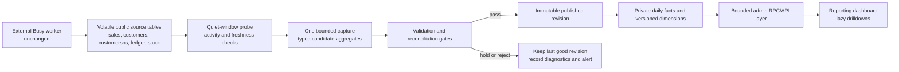

# PASPL Weekly Reporting and Snapshot System Plan

**Status:** Proposed architecture and delivery plan — documentation only

**Date:** 2026-08-09

**Primary constraint:** The external Busy worker cannot be changed.

**Target outcome:** A trustworthy weekly reporting dashboard with daily reconciliation, historical comparison, and bounded impact on the production Supabase database.

> This document proposes future work. It does not authorize or apply database migrations, cron changes, worker changes, or frontend changes.

## 1. Executive decision

Build a compact, versioned reporting layer beside the Busy-synced tables. Do not point the dashboard at the raw Busy tables, and do not make a permanent daily copy of every raw table.

The reporting layer should:

1. Read each required raw source in one bounded, off-peak capture.
2. Validate that the source appears complete enough to use.
3. Convert text dates and amounts once.
4. Store typed daily aggregates and only the history needed for audit and drilldown.
5. Publish a new immutable report revision only after reconciliation succeeds.
6. Keep serving the last good revision if the next run fails.
7. Derive week, month, quarter, and financial year from the same daily facts.

Automation is the final phase, not the first. The first usable reports should be generated manually and reviewed against Busy. Once the numbers are trusted, the same pipeline can run on Sunday with strict resource and failure controls.

### Why this is the right shape

- A table existing in Supabase is not the expensive part. Repeated full scans, text parsing, delete/reinsert cycles, and index churn are the expensive parts.
- One bounded daily scan is materially safer than the current pattern of repeatedly parsing the same raw sales history.
- A raw mirror alone would reproduce the worker's partial-delete/reload problem. A validated, published snapshot creates a correctness boundary.
- Daily is the canonical time grain. Separate weekly, monthly, quarterly, and yearly copies would create unnecessary storage and reconciliation paths.

## 2. Current-state findings

These values were observed during the live audit and are planning baselines, not permanent assumptions. Phase 0 must measure them again.

| Area | Observed state | Consequence |
|---|---|---|
| Raw sales | About 261,270 rows and 110 MB; dates and numeric measures are stored as text | Parsing and validation are CPU work; indexes cannot help function-wrapped text dates effectively |
| Sales sync | Full delete followed by about 26 upsert batches; approximately 14 seconds of database execution per reload was observed | Readers can see a stable but incomplete table if the worker stops partway through |
| Ledger sync | Full delete followed by about 9 upsert batches | Treat it as a volatile source, not historical storage |
| Customer outstanding | About 7,395 current rows; previous snapshots are overwritten | Historical receivable movement cannot be reconstructed unless snapshots start now |
| Location stock | About 25,026 current rows and high cumulative update volume | Detailed daily stock snapshots would grow quickly and create write amplification |
| Current sales aggregate | `sales_achievement_daily` contains about 46,574 rows and is actively delete/reinserted by refreshes | Current reconciliation does write data, but it is a mutable cache, not a durable published snapshot |
| Current scheduling | Recent refresh approximately every 3 minutes; active-FY refresh daily | The same raw sales data is parsed far more often than a weekly reporting product requires |
| Current refresh SQL | The raw sales table is scanned for diagnostics and again for aggregation | At the observed size and cadence, this implies hundreds of millions of raw-row evaluations per day |
| Customer identity | Raw sales contains party text, not a stable customer id | City and customer drilldowns depend on a reviewed identity map |
| Salesperson attribution | About 10.9% of the audited active-FY raw lines were unmatched | Per-salesperson ranking is not trustworthy until coverage improves and the residual is shown |
| Worker coordination | No accessible run id, completion marker, manifest, or checksum | The reporting system can establish high confidence, but cannot prove source completeness |

The current reconciliation is therefore not “writing nothing.” It writes and rewrites the derived daily achievement table and refresh-run records. Its weakness is not absence of output; it is repeated work, weak duration telemetry, mutable results, and no immutable publication boundary.

## 3. Scope

### In scope

- Daily canonical sales facts.
- Sunday publication of a weekly reporting revision.
- Week, month, quarter, and Indian financial-year comparisons.
- Drilldown paths for:
  - company → city → customer;
  - company → salesperson → customer;
  - company → product segment → item group;
  - cross-filtering by period, city, customer, salesperson, and product segment.
- Versioned targets and mappings.
- Weekly receivable snapshots.
- Stock snapshots at a deliberately bounded grain.
- Reconciliation, data-quality evidence, observability, rollback, and retention.

### Deferred unless explicitly approved

- Full invoice-line or raw-ledger archival inside Supabase.
- Invoice PDF/detail reproduction.
- Forecasting, machine learning, or anomaly prediction.
- Rebuilding or changing the external Busy worker.
- A separate warehouse or read replica before measured load justifies it.
- Realtime streaming of finance data to the browser.

## 4. Non-negotiable correctness rules

1. **The dashboard never reads raw Busy tables.** Only the controlled capture process may read them.
2. **A failed run cannot replace a successful run.** Publication is a small atomic pointer/state change after validation.
3. **Published revisions are reproducible.** Each revision records its source proof, metric version, calendar version, target version, and mapping versions.
4. **Residuals stay visible.** Unassigned city, customer, salesperson, or product value must appear as `Unmapped`/`Unattributed`; it must never silently disappear.
5. **Totals conserve value.** Company totals must equal every complete dimensional breakdown plus its explicit residual.
6. **Closed periods are not silently rewritten.** A late Busy correction creates a new revision and an adjustment record.
7. **Failure means stale, not unavailable.** The last valid published revision remains readable.
8. **Targets and ownership are historical facts.** Editing a current customer or target must not rewrite what a prior report displayed.

## 5. Proposed architecture



### Database boundaries

- Keep external source tables under their current worker-owned contract.
- Put reporting internals in a private schema such as `reporting_private`.
- Expose only narrow, authenticated RPCs or equivalent server endpoints.
- Do not expose private facts, refresh functions, or service-role credentials to the browser.
- Prefer invoker-safe access patterns. If a privileged function is unavoidable, use explicit authorization, an empty search path, fully-qualified objects, and revoked default execution.

## 6. Snapshot contract

### 6.1 Run states

Every capture has exactly one state:

```text
observing → capturing → validating → published
                               ├──→ published_with_warning
                               ├──→ held_for_review
                               └──→ rejected
```

- `published`: all mandatory gates passed.
- `published_with_warning`: company facts are valid, but a non-critical dimensional coverage threshold is missed; affected breakdowns visibly show the residual.
- `held_for_review`: the input could be a legitimate correction or an incomplete worker reload; human approval is required.
- `rejected`: schema, parsing, duplication, or conservation rules failed.

Only `published` and explicitly permitted `published_with_warning` runs may become the dashboard's current revision.

### 6.2 Proposed logical entities

Names are conceptual and should be confirmed during schema design.

| Entity | Purpose | Retention behavior |
|---|---|---|
| `snapshot_run` | One record per attempt: state, timestamps, source proof, row counts, duration, error, code/metric versions | Permanent metadata |
| `source_fingerprint` | Counts, date bounds, financial-year/month totals, unique keys, amounts, quantities, and optional digest | Permanent per run |
| `sales_daily_version` | Typed sales aggregate versions at the minimum drilldown grain | Append only for new or changed grains |
| `sales_invoice_daily` | Invoice-level fact used for non-additive invoice counts, if required | Add after metric contract is proven |
| `published_period` | Small pointer from a report period to its approved run/revision | Permanent revision history |
| `customer_identity_map` | Raw party alias to canonical customer with method, confidence, and review state | Version changes; never overwrite reviewed history |
| `customer_dimension_version` | City, current owner, terms, and status changes captured as change events | Store changed versions, not daily copies |
| `salesperson_alias_version` | Raw transaction salesperson to canonical salesperson | Versioned |
| `product_segment_map_version` | Raw product group/item to reportable segment | Versioned |
| `target_version` | FY × salesperson × product segment targets and effective revision | Versioned; preserve zero values |
| `receivable_snapshot_weekly` | Bill/customer outstanding at a weekly point in time | Weekly detailed retention |
| `stock_snapshot` | Stock evidence at the approved grain | Weekly detail with rollup/retention policy |
| `reconciliation_result` | Machine-readable result for every gate | Permanent per run |

### 6.3 Recommended sales grain

Start with:

```text
business_date
× canonical_customer
× invoice_salesperson
× product_segment
× item_group
× material_center (only if the business needs it)
```

Measures should include signed taxable sales, signed net sales, positive sales, returns, signed quantity, line count, and source coverage flags.

Important distinctions:

- The invoice's salesperson is the historical transaction attribution.
- The customer master's current salesperson is current account ownership.
- Both can be shown, but they must never be silently substituted for one another.
- City should resolve through a versioned customer identity/dimension mapping; unresolvable value goes to `Unmapped`.
- Distinct invoices and distinct customers are non-additive. Do not sum counts across product segments or days. Use an invoice fact or calculate them from a compatible lower grain.

### 6.4 Daily, weekly, monthly, quarterly, and yearly data

Daily facts are canonical. The other periods are views or query-time rollups over published daily data:

- Week: explicitly define week start/end and working days.
- Month: calendar month within the financial year.
- Quarter: Indian FY quarters.
- Financial year: April 1 through March 31.

Do not create four permanent copies on day one. Add a cached period summary only if measured dashboard latency exceeds its budget. Every cache must be disposable and reproducible from daily facts.

### 6.5 As-published versus restated reporting

Support two explicit modes:

- **As published:** show exactly what the approved weekly report showed at that time.
- **Restated:** apply later Busy corrections and the current approved mapping logic.

The default executive view should be as published, with a clear adjustment indicator when restated results differ. This prevents historical targets, mappings, and ownership changes from silently changing prior reports.

## 7. Working around the immutable worker

The worker's delete/reinsert behavior cannot be made atomic from the reporting system. PostgreSQL transaction isolation can provide a consistent point-in-time read, but it cannot tell whether that point was the middle of a partial reload.

The capture protocol should therefore be:

1. Observe source-table activity counters and freshness signals for a configurable quiet window.
2. Start only when the database is below its reporting-load guardrail.
3. Build the typed candidate in one bounded statement or short read-only snapshot.
4. Collect the full source fingerprint in the same pass where practical.
5. Recheck source activity immediately after capture.
6. Reject and retry later if the source changed during capture.
7. Compare completeness and period distributions with the prior published revision.
8. Publish only after all mandatory validation gates pass.

Avoid repeated exact `count(*)` stability probes; they would create extra full scans. Low-cost activity signals should establish the quiet window, followed by one exact candidate/fingerprint pass.

### Limitation that must remain visible

If the worker deletes the table, inserts 80%, crashes, and then remains quiet, quiet-window checks alone will call the table stable. Differential and completeness gates should catch most such events, but a plausible partial reload can still escape detection.

Under the “worker cannot change” constraint, label the input confidence `observed_stable`, not `source_confirmed`.

A truly source-confirmed 10/10 design requires one of:

- a worker completion marker and expected row/count/checksum manifest; or
- an independent trusted Busy export total/checksum that the reporting run can verify.

## 8. Validation and reconciliation gates

### 8.1 Source stability gates

- No observed source writes throughout the configured quiet window.
- No observed source writes during candidate capture.
- Required source tables exist with the expected columns and types.
- Source freshness is within the agreed operational window.
- Candidate capture finishes within its statement-time budget.

### 8.2 Structural gates

- Duplicate source business keys are zero, or follow a documented exception rule.
- Invalid date and numeric parse counts are below explicit thresholds.
- Minimum and maximum voucher dates are plausible.
- Required financial years and recent business dates are present.
- No unexpected new salesperson, party, product group, or material-center labels are silently classified.

### 8.3 Completeness and change gates

Compare with the previous approved revision by financial year and month:

- source rows;
- unique voucher/business keys;
- distinct bills;
- gross sales, returns, and signed net sales;
- signed quantity;
- customer, salesperson, and product coverage;
- latest available transaction date.

Thresholds are not permission to hide a discrepancy. They determine whether a change publishes, publishes with warning, or is held for review. Legitimate backdated corrections should be approved as a new revision with the delta recorded.

### 8.4 Conservation gates

At a common rounding rule:

```text
raw company net
= canonical daily net
= city total + unmapped city
= customer total + unmapped customer
= salesperson total + unattributed salesperson
= product-segment total + unclassified product
```

The expected currency difference is zero after shared parsing and rounding, with only an explicitly approved smallest-unit tolerance if Busy itself rounds differently.

### 8.5 Publication policy by data quality

| Condition | Outcome |
|---|---|
| Source stability, parsing, duplication, or company conservation fails | Reject; serve previous snapshot |
| Large unexplained period drop/change | Hold for review |
| Company totals pass but a dimensional mapping threshold misses | Publish with warning only if residual is displayed and affected rankings are suppressed |
| Salesperson unattributed value is above 0.5% | Do not publish authoritative salesperson ranking |
| Customer/city mapping covers less than 97% of absolute sales value | Block decision-grade city/customer KPIs or show them as incomplete |
| All mandatory and approved coverage gates pass | Publish |

The 0.5% and 97% thresholds are starting policy proposals. Phase 0 must formally approve them.

## 9. Metric and drilldown contract

### 9.1 Required filters

- As-of publication/revision.
- Financial year and period: week, MTD, QTD, FYTD, prior comparable period.
- City.
- Customer.
- Invoice salesperson.
- Current customer owner, separately labelled.
- Product segment and item group.

### 9.2 Primary drilldowns

```text
Company
├── City
│   └── Customer
│       └── Product segment / item group
├── Salesperson
│   └── Customer
│       └── Product segment / item group
└── Product segment
    ├── City
    ├── Customer
    └── Salesperson
```

Invoice and SKU-level detail should be a later opt-in. It requires either a lower-grain durable fact or a carefully controlled detail store; it should not force every dashboard query back to raw `sales`.

### 9.3 Comparison semantics

Every change indicator must name its comparison:

- current week versus prior week;
- MTD versus same working-day point last month;
- FYTD versus the same elapsed working-day fraction last FY;
- actual versus phased target;
- as-published versus restated correction.

Do not compare unequal elapsed periods without working-day normalization.

### 9.4 Product-segment rules

- The segment taxonomy must be versioned and owned.
- New/unclassified source labels appear in a visible residual queue.
- Returns stay attached to the original segment when resolvable.
- Segment totals must conserve to company totals.
- Product penetration and repeat rate use distinct-customer/invoice logic, not summed daily counts.

## 10. Resource-safety design

### 10.1 What the system must not do

- No report query directly over raw tables from the browser.
- No refresh trigger on every worker write.
- No whole-history delete/reinsert of reporting facts.
- No schema migration that also performs a backfill or refresh.
- No concurrent reporting writers.
- No immediate unbounded retries.
- No long-lived transaction waiting for the worker.
- No dashboard request that computes full-history text parsing.
- No automatic materialized-view refresh until its lock behavior is tested.

### 10.2 Bounded execution controls

- One reporting writer protected by an advisory try-lock.
- Separate short `lock_timeout` and bounded `statement_timeout` for capture, publish, and browser reads.
- Manual first run, then one scheduled weekly run; daily reconciliation only after measured evidence shows it is safe.
- Batch initial backfill by financial month, commit each verified month independently, and stop on the first failed checkpoint.
- Use temporary/unlogged candidate storage where durability is unnecessary; publish durable facts only after validation.
- Append changed versions and tombstones rather than rewriting unchanged history.
- Publish with a small atomic state/pointer update.
- Keep the prior snapshot available throughout capture and after any failure.

Postgres does not provide a simple per-query CPU cap. Timeouts, concurrency limits, off-peak scheduling, bounded scans, workload admission checks, and reduced frequency are the practical controls.

### 10.3 Provisional performance budgets

These are starting gates and must be calibrated from Phase 0 measurements.

| Workload | Initial target | Hard behavior |
|---|---:|---|
| Dashboard overview RPC | p95 below 500 ms | Cancel at 3–5 seconds |
| Paginated drilldown RPC | p95 below 1.5 seconds | Cancel at 5 seconds |
| Daily/weekly candidate capture at current scale | Target below 60 seconds | Abort rather than run indefinitely |
| Publish transaction | Below 2 seconds | Roll back fully on failure |
| Concurrent reporting writers | 1 | Second run exits without waiting |
| Automatic retry | At most one delayed retry in the same window | No retry storm |

The scheduler should skip or defer work when production load, connection pressure, replication lag, or a Busy sync is active. Exact thresholds depend on which Supabase metrics are accessible and the normal baseline; do not invent them before measurement.

### 10.4 Why the new path should be cheaper

At the audited cadence, the current recent refresh can cause roughly 480 executions per day, and its SQL scans raw sales more than once. A single daily capture reduces raw-scan frequency by approximately two orders of magnitude even before SQL optimization.

This is an inference from the observed schedule and plan shape, not a benchmark. Phase 0 must measure actual buffers, execution time, CPU, memory pressure, WAL, and rows written before and after.

### 10.5 Storage policy

- Sales: keep typed daily/versioned aggregates; unchanged reloads should add metadata, not duplicate all facts.
- Receivables: about 7.4k rows weekly is roughly 385k rows/year at the current scale and is reasonable, subject to indexes and retention.
- Location stock: about 25k rows weekly is roughly 1.3m rows/year. This is the first material storage-growth risk.
- Prefer weekly stock at the minimum decision grain, keep detailed weekly history for a bounded operational window, and retain month-end detail/long-term rollups thereafter.
- Do not store daily detailed stock unless a named metric requires it and a capacity test approves it.
- Keep raw candidate copies only for the duration needed to validate and publish.

## 11. Major computation flags

| Computation | Cost risk | Safe approach |
|---|---|---|
| Parsing text date/amount/quantity across raw sales | High when repeated | Parse once in one off-peak candidate scan; store typed results |
| Full-history reconciliation | Medium at current size; grows linearly | One pass, partition results by FY/month, reuse the candidate |
| Row-level cryptographic checksum | CPU-heavy | Optional weekly/changed-period evidence; calculate in the capture pass, never per dashboard request |
| Distinct invoices/customers across many dimensions | High and easy to double-count | Separate compatible fact grain; precompute only measured hot paths |
| Named customer gap decomposition | Potentially high joins and window ranking | Run from typed facts, restrict to top gaps/periods, cache in the published revision |
| Product penetration/repeat rate | Medium distinct-count workload | Calculate at publication or from invoice/customer facts, not on every page render |
| Detailed stock history | High storage/index-write growth | Weekly bounded grain plus retention/rollup policy |
| Backfilling all financial years | Burst CPU, I/O, WAL | Month-bounded resumable jobs with validation checkpoint after each month |
| Multiple dashboard filters at once | Query explosion | Lazy drilldowns, pagination, indexed predicates, response limits, short timeouts |

## 12. Failure-mode pressure test

| Failure | Detection | Required response |
|---|---|---|
| Capture overlaps a Busy reload | Source activity changes before/after capture | Reject candidate and retry once after a quiet window |
| Worker stops after a partial reload | Volume/date/distribution/completeness deviation | Hold; keep previous publication; require review |
| Partial reload happens to look plausible | May evade local gates | Expose `observed_stable` confidence; only an external manifest can close this gap |
| Legitimate deletion or backdated correction | Diff looks similar to incomplete data | Human reviews affected periods; publish a new revision and adjustment, never overwrite silently |
| Reporting query times out | Run record reaches failed/rejected state | No partial publication; no aggressive retry |
| Scheduler fires twice | Advisory try-lock is already held | Duplicate exits immediately |
| Supabase is already under load | Admission guard fails or operation exceeds budget | Skip/defer; alert only after defined freshness threshold |
| Mapping coverage drops | Coverage gate and residual value | Publish company total only when safe; suppress misleading breakdown/ranking |
| Target/calendar version missing | Semantic precondition fails | Show `not available`; do not guess |
| Metric code changes | Metric version differs | Shadow old and new results; approve a new report revision |
| Dashboard traffic spikes | RPC latency/concurrency alerts | Serve cached/published facts, paginate, time out; raw database remains isolated |
| Scheduled run fails on Sunday | No new published revision by deadline | Monday dashboard shows last publication and a prominent stale-data warning |

## 13. Delivery plan

Estimated effort for one senior full-stack/data engineer is **9–13 weeks** for a reliable internal dashboard and **12–16 weeks** for a hardened automated system. Two engineers may reduce elapsed time to roughly **7–10 weeks**, but identity mapping and reconciliation remain serial critical-path work.

### Phase 0 — Safety baseline and metric contract (3–5 working days)

Deliverables:

- Remeasure source sizes, reload pattern, current cron duration, buffer reads, WAL, locks, CPU, memory, and connection baseline.
- Confirm which current screens depend on the 3-minute achievement refresh and their freshness SLA.
- Fix future duration measurement design to use wall-clock timestamps rather than transaction-stable timestamps.
- Freeze date, sign, return, invoice identity, customer, salesperson, city, product, target, and working-day definitions.
- Approve source completeness thresholds, mapping thresholds, performance budgets, Sunday time zone/window, and data owners.
- Produce read-only reconciliation queries with fixed sample-month results.

Exit gate:

- Definitions are signed off.
- Read-only source queries reconcile for both loaded FYs and selected months.
- No production query required by the proposed build runs without an explain plan and timeout.

Potential early containment, only after dependency review:

- Increase the current 3-minute reporting refresh interval to 15–30 minutes if its consumer SLA allows it.
- Do not change the external Busy worker.

### Phase 1 — Identity and versioned dimensions (1–2 weeks)

Deliverables:

- Customer alias/canonical identity workflow with exact match, unique normalized match, collision queue, and manual review.
- Separate historical invoice salesperson and current customer owner.
- City normalization and visible `Unmapped` bucket.
- Salesperson alias and product-segment mapping versions.
- Working-day calendar version.
- Target version contract that preserves zeros and prior approved values.
- Coverage report by row count and absolute sales value.

Exit gate:

- Customer/city mapping reaches the approved decision-grade threshold.
- Salesperson unattributed value is below 0.5% before authoritative rankings are enabled.
- All collisions and unresolved residuals are visible and owned.

### Phase 2 — Snapshot control plane and manual candidate capture (1–2 weeks)

Deliverables:

- Private run, source-proof, validation-result, and publication metadata model.
- Quiet-window probe and workload-admission design.
- Candidate capture with one-pass typed parsing and run states.
- Mandatory structural, completeness, and conservation validations.
- Manual admin/operations trigger only.
- Failure records that survive a rolled-back candidate/publish transaction.

Exit gate:

- Killing a supervised capture cannot affect the last published revision.
- Partial/reordered input test fixtures are held or rejected.
- An unchanged rerun produces no new fact versions and an identical fingerprint/output.

### Phase 3 — Canonical daily facts and bounded backfill (2 weeks)

Deliverables:

- Daily versioned sales fact at the approved grain.
- Optional invoice fact only if required by approved metrics.
- Change/diff recording for late corrections and deletions.
- Month-bounded, resumable historical backfill outside schema migrations.
- Weekly receivable snapshot.
- Stock snapshot at the approved minimal grain and retention policy.
- Current/revision-aware query views.

Exit gate:

- Every loaded month has a successful reconciliation checkpoint.
- Duplicate fact grains are zero.
- Raw → daily → every dimensional rollup conserves exactly.
- Backfill stays within the Phase 0 resource budget and causes no material production-latency regression.

### Phase 4 — Read API and dashboard (2–3 weeks)

Deliverables:

- Admin-only bounded APIs/RPCs for overview and lazy drilldowns.
- Company, city, customer, salesperson, and product-segment views.
- Week/MTD/QTD/FYTD and prior comparable-period changes.
- As-published/restated selector and correction indicator.
- Mapping coverage, source confidence, freshness, residuals, and stale states visible in the UI.
- Pagination, response-size caps, request cancellation, and feature flag.

Exit gate:

- No dashboard request touches raw Busy tables.
- Authorization matrix passes for anonymous, sales, billing, inactive admin, and active admin roles.
- Representative RPCs meet latency budgets at production-scale cardinality.
- Company totals reconcile with every complete drilldown.

### Phase 5 — Shadow operation and resilience testing (2–3 weeks)

Deliverables:

- Four to six supervised weekly/manual publications compared with Busy and the existing achievement output.
- Load and soak test at expected and at least 2× expected dashboard concurrency.
- Worker-overlap, partial-reload, timeout, cancellation, duplicate-run, mapping-regression, and schema-drift tests.
- Operator runbook, alerts, ownership, and rollback rehearsal.
- Resource comparison of old and new workloads.

Exit gate:

- Four consecutive candidate publications reconcile with no unexplained drift.
- Forced failures preserve the last good dashboard.
- No unacceptable production CPU, memory, lock, connection, or latency regression.
- The business owner stops finding unaccounted differences during manual verification.

### Phase 6 — Sunday automation and controlled cutover (1–2 weeks)

Deliverables:

- One Sunday schedule in `Asia/Kolkata`, placed only after observed Busy quiet-window behavior is understood.
- At most one delayed automatic retry.
- Stale/failure alert before the Monday operating window.
- Canary enablement behind the feature flag.
- Repoint, reduce, or retire the current high-frequency reporting refresh only after dependency and parity gates pass.

Exit gate:

- Two scheduled weekly runs and the agreed daily reconciliation trial complete inside budget.
- The old reporting workload can be disabled without breaking existing consumers.
- Rollback to the previous published revision and old dashboard path has been rehearsed.

### Phase 7 — Optimize only from evidence (ongoing)

Possible changes, each requiring measured justification:

- Daily automated reconciliation instead of weekly-only capture.
- Cached month/quarter/FY summaries.
- Invoice/SKU drilldown facts.
- Read replica for analytical read isolation.
- Separate warehouse when retention, concurrency, or workload isolation exceeds the primary database budget.

A read replica improves read isolation but does not solve source correctness: it can faithfully replicate the worker's partial delete/reinsert state.

## 14. Test strategy

### Correctness tests

- Date and numeric parsing, including invalid/blank values.
- Return and cancellation sign behavior.
- Invoice identity across multi-line and multi-segment bills.
- Customer alias collision and reviewed-map preservation.
- Invoice salesperson versus current-owner semantics.
- Week, month, quarter, FY, leap-day, and FY-boundary calculations.
- Non-additive customer/invoice counts.
- Target/calendar/mapping version selection.
- Raw-to-fact conservation and residual publication.

### Integration and failure tests

- Source activity starts before and during capture.
- Worker-like full delete plus partial batch reload.
- Cancellation during candidate build, validation, and publish.
- Lock contention and duplicate scheduler invocation.
- Schema/label drift.
- Missing target/calendar/snapshot dependency.
- Legitimate correction to a closed period.
- Retry after failure produces one logical publication.

### Performance tests

- `EXPLAIN (ANALYZE, BUFFERS)` for capture and representative RPCs on production-scale data in a safe environment/window.
- Backfill one month, then a full FY using checkpoints.
- Dashboard load at expected and 2× expected concurrency.
- Monitor database CPU, memory, cache hit rate, active connections, lock waits, WAL growth, table/index growth, and application latency.
- Soak the dashboard against a fixed published snapshot; query latency must not deteriorate over time.

## 15. Observability and operating contract

Each run should expose:

- actual start, capture finish, validation finish, and publication timestamps;
- stage durations and rows processed/written;
- source fingerprint and source-confidence label;
- previous and current period deltas;
- mapping/unclassified coverage by count and value;
- validation outcomes and failure reason;
- last successful publication and age;
- database work indicators available to the team;
- metric, calendar, target, mapping, and application versions.

Suggested service objectives:

- The last valid report remains available even when a new run fails.
- A Sunday failure is visible before Monday's operating review.
- The dashboard clearly shows publication time, source confidence, and staleness.
- No single report request is allowed to exhaust the database indefinitely.
- There is one named owner for failed runs and one named owner for unresolved mappings.

## 16. Cutover and rollback

### Cutover order

1. Ship metadata/control plane with no schedule.
2. Complete manual identity and reconciliation work.
3. Backfill in verified monthly checkpoints.
4. Ship private read APIs.
5. Ship the dashboard behind a disabled feature flag.
6. Shadow and compare.
7. Enable admin canary users.
8. Add Sunday automation.
9. Only then reduce/repoint/retire the old high-frequency reporting job.

During shadow, old and new reporting workloads coexist. Schedule the new capture outside the existing refresh and worker windows and measure the combined load.

### Rollback order

1. Disable the dashboard feature flag.
2. Unschedule the new reporting job.
3. Leave the last published revision readable for diagnosis if safe.
4. Restore the prior read API/published pointer.
5. Do not modify or restore raw Busy tables.
6. Clean up facts only in a separate reviewed operation after exporting required mappings/audit evidence.

## 17. Decisions required before implementation

| Decision | Recommended default | Owner |
|---|---|---|
| Authoritative sales value | Signed taxable value unless the approved target contract says net amount | Finance + sales leadership |
| Week boundary | Monday–Sunday using `Asia/Kolkata` | Business owner |
| Sunday run time | Choose after at least two weeks of observing worker/source quiet periods | Engineering/operations |
| Closed-period policy | New revision with visible adjustment; no silent rewrite | Finance |
| City source | Versioned canonical customer mapping; `Unmapped` residual | Sales operations |
| Historical salesperson | Invoice-line salesperson; current owner shown separately | Sales leadership |
| Product taxonomy | Versioned business-owned segment map | Product/sales operations |
| Stock grain and retention | Weekly minimum decision grain; month-end long-term retention | Operations + engineering |
| Mapping publish thresholds | 97% customer/city by value; <0.5% salesperson residual for ranking | Business + engineering |
| Source confidence acceptance | Accept `observed_stable` with visible limitation, or provide independent Busy manifest | Executive owner |
| Daily versus weekly capture | Start manual/weekly; add daily only after load and correctness gates | Engineering |

## 18. Definition of done

The system is done when:

- Weekly reports publish without querying raw tables from the dashboard.
- Daily facts produce all agreed week/month/quarter/FY views from one canonical source.
- Company, city, customer, salesperson, and product totals reconcile with explicit residuals.
- Prior published reports remain reproducible after corrections and mapping/target changes.
- Failed, partial, overlapping, or duplicate runs cannot replace the last valid report.
- Browser access is bounded and authorized; private finance facts are not directly exposed.
- Capture, backfill, and dashboard workloads meet agreed CPU, memory, connection, lock, latency, and storage budgets.
- The Sunday job has a runbook, alerts, owner, retry limit, and tested rollback.
- Existing reporting refreshes are retired or repointed only after proven dependency parity.
- Business owners trust the numbers after the required shadow period.

## 19. Architecture score

Under the unchangeable-worker constraint, this proposal is approximately **8/10**:

- **Correctness: 7/10** — strong local validation and immutable publication, but no upstream proof of reload completion.
- **Availability: 9/10** — last-known-good publication remains available on failure.
- **Performance isolation: 8/10** — large frequency reduction and bounded queries, but capture still shares the primary database.
- **Maintainability: 8/10** — one canonical daily model and versioned semantic inputs.
- **Operability: 8/10** — explicit states, telemetry, alerts, retry limits, and rollback.

The path to 10/10 is not another SQL optimization. It is an independent trusted source manifest/completion proof and, if measured scale requires it, physical analytical workload isolation.

## 20. Reference material

- [Target reporting specification](/Users/maitreya/Downloads/PASPL_Target_Reporting_Spec.md)
- [CEO sales analytics revised plan](./CEO_SALES_ANALYTICS_REVISED_PLAN.md)
- [Busy live tables analysis](./BUSY_LIVE_TABLE_ANALYSIS.md)
- [Engineering strategy summary](./ENGINEERING_STRATEGY_SUMMARY.md)
- [Current performance audit findings](../PERFORMANCE_AUDIT_FINDINGS.md)
- [`sales_achievement_daily` refresh migration](../supabase/migrations/20260711143428_performance_efficient_busy_sales_dashboard.sql)
- [Latest salesperson/category target mapping refresh](../supabase/migrations/20260713001934_salesperson_specific_sales_target_mappings.sql)
- [Busy stock worker fast-path notes](../supabase/migrations/124_erp_location_stock_worker_fast_path.sql)
